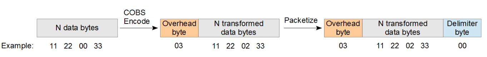
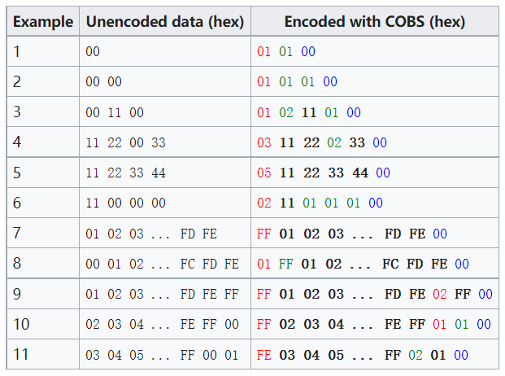

# 高效可靠的数据字节编码算法 COBS

COBS（Consistent Overhead Byte Stuffing）提供了一种避免特殊字符冲突并保持固定开销的编码方案。相比ASCII转换和时间间隔分帧，COBS能提高效率并确保实时性。

COBS 是一种将字节包编码为不包含零值 (0x00) 字节的形式的方法。输入的字节包可以包含 0x00 到 0xFF 的全范围内的字节。保证 COBS 编码的数据包生成的数据包仅包含 0x01 到 0xFF 范围内的字节。因此，在通信协议中，可以用 0x00 字节可靠地界定数据包边界。 COBS 编码确实必须增加数据包大小才能实现这种编码。但是，与其他字节填充方法相比，数据包大小的增加是合理且可预测的。COBS 总是在消息长度上增加 1 个字节。此外，对于长度为n的较长数据包，它可能会向编码数据包大小添加 n/254（向下舍入）额外字节。 例如，与使用 0x7E 字节分隔 PPP 数据包的 PPP 协议相比。PPP 协议使用“转义”式的字节填充，将数据包中所有出现的 0x7E 字节替换为 0x7D 0x5E。但在最坏的情况下，这种字节填充方法可能会使数据包的大小翻倍。COBS 使用不同的字节填充方法，它具有更合理的最坏情况开销。

## 作用：帧边界

以modbus rtu通信为例，一般是3.5字符作为帧间隔区分，而使用COBS就不需要这样了，他是将范围 [0，255] 内的任意字节字符串转换为 [1，255] 范围内的字节。从数据中消除所有0，现在可以使用0来明确标记转换后数据的结束

### 原理说明

固定2个字节开销(首字节,尾字节)

首字节:第1个零所在位置

第1个零所在字节: 记录第2个零相对于第1个0所在位置

第2个零所在字节: 记录第3个零相对于第2个0所在位置

尾字节:0x00

缺点(待测): 数据长度大于256时, 前256个字节内必须要有0, 且数据内0的间隔也要在256内

  
