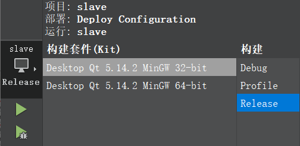
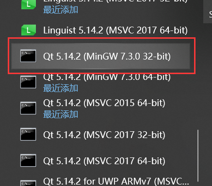
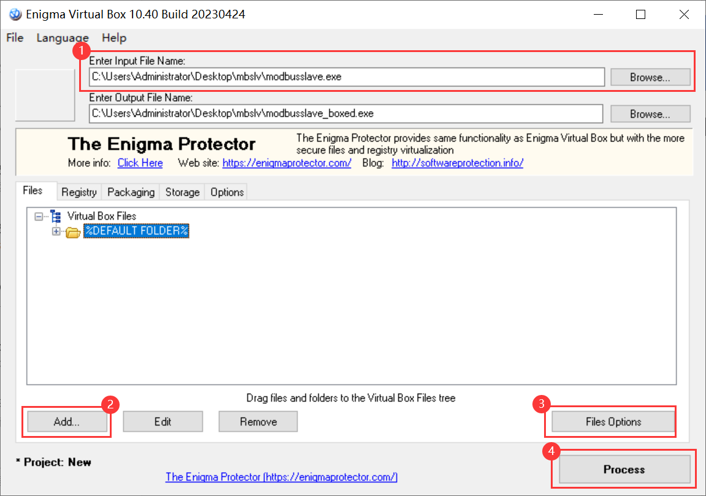

[Qt 5.14](https://download.qt.io/archive/qt/5.14/) 

##### 程序导出

① 将程序编译为 release 版本



② 将编译出来 exe 复制到单独的文件夹中。

（我的在 `build-slave-Desktop_Qt_5_14_2_MinGW_32_bit-Release\release`）

此时的 exe 文件是不能运行的，会提示缺少相关的依赖文件。

③ 找到构建工具（需和 kit 对应），并通过 cd 进入到存放 exe 的文件夹中。



④ 生成依赖环境

在命令行中键入以下命令后，会自动复制 Qt 动态链接库：

```shell
windeployqt demo.exe
```

⑤ 删除无关文件以减少文件体积（可选）

等一个一个测试，删除无关文件时不会影响程序运行的。

##### 程序打包

需安装 enigmavb

① 选择程序（exe）

② 添加文件递归（Add Folder Recursive）

③ 开启体积压缩（Compress Files）

④ 打包程序



##### 切换盘符

```
C:\Qt\Qt5.14.2\5.14.2\mingw73_32>F:
F:\>
```

