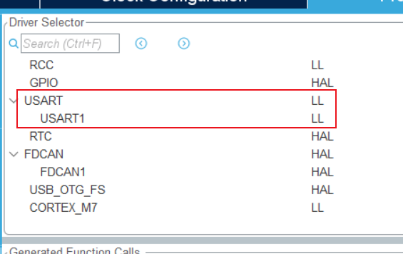
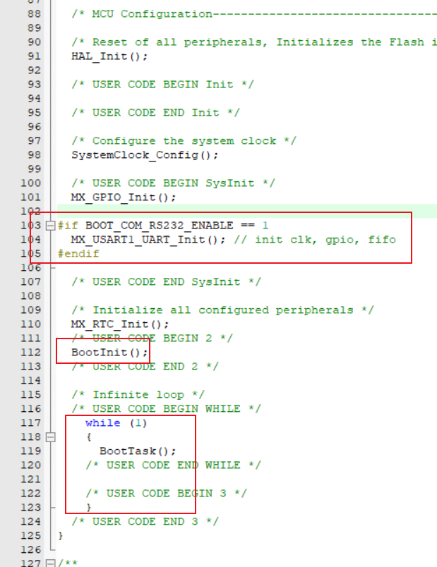
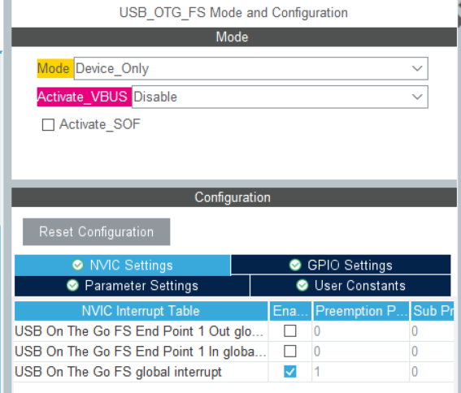
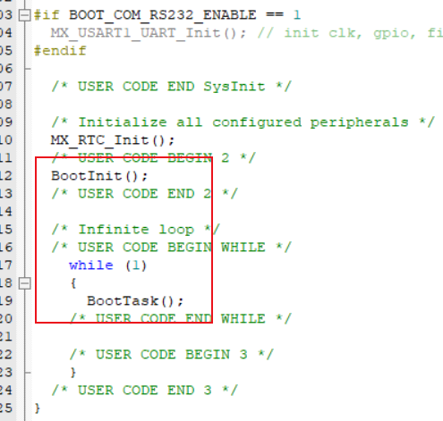
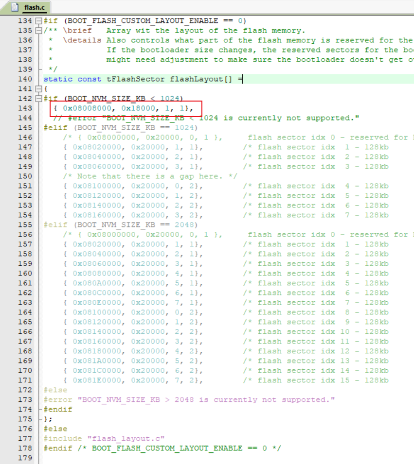

[TOC]

# OpenBLT

## 移植记录

### 通讯配置

#### RS232

* 参数配置

* 选择 LL 库

* 在初始化后，调用 OpenBLT 相关函数

#### USBD

* 默认配置，启用中断

* 调用 OpenBLT 相关函数

#### CAN

* TODO

### 接口配置

### Flash 配置

配置 APP 地址，扇区容量

