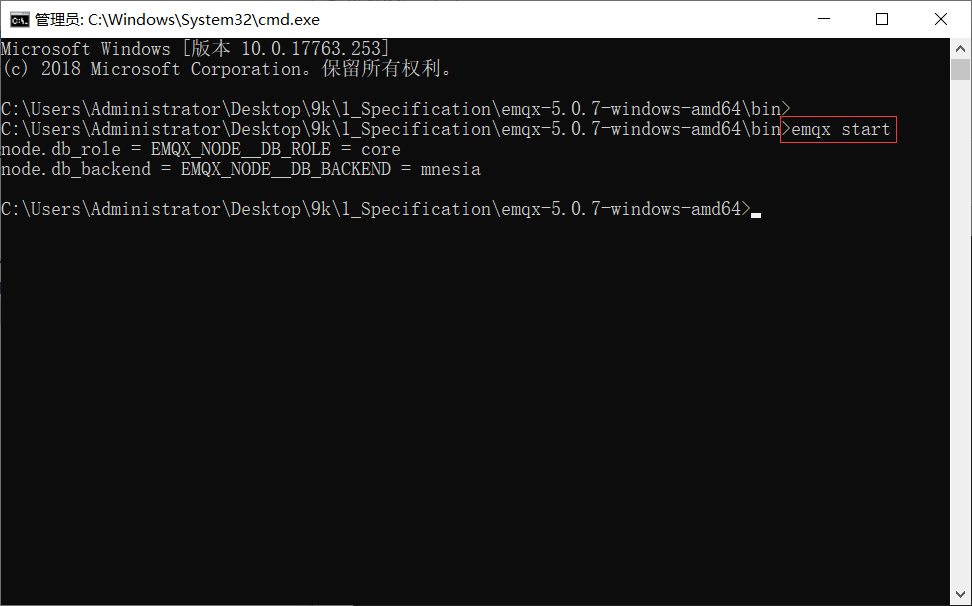
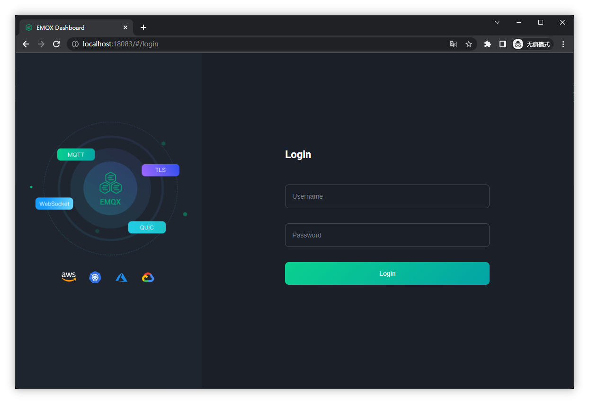
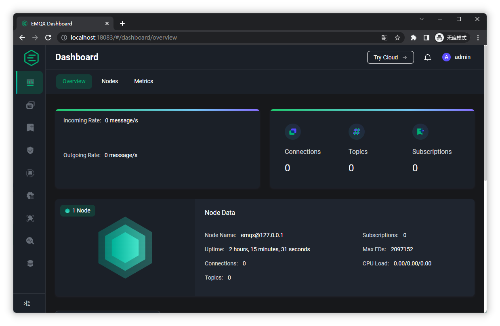
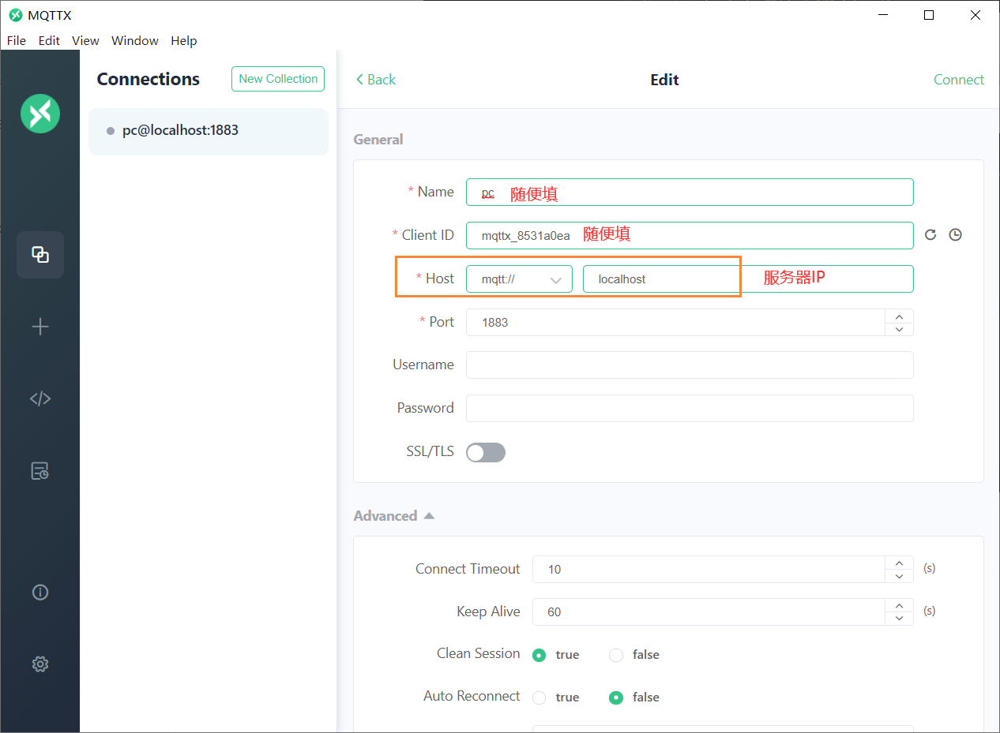
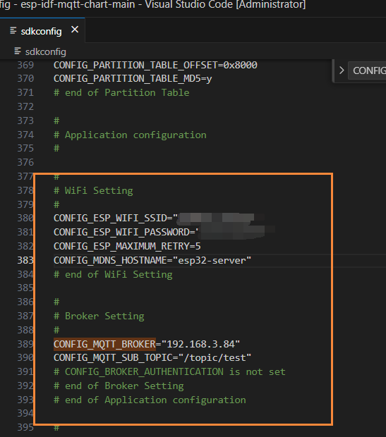
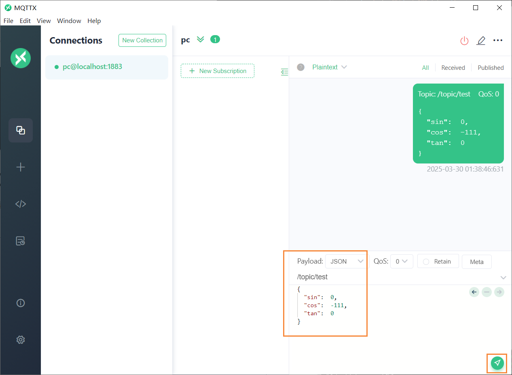
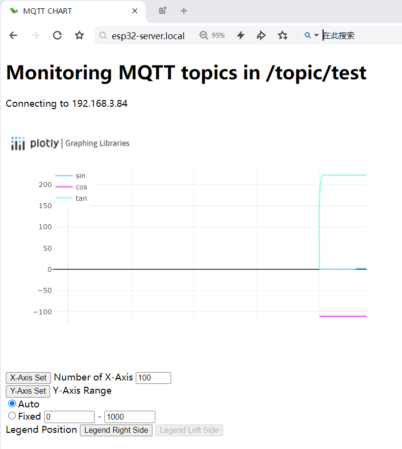

# MQTT Server (EMQX)

在 https://www.emqx.io/zh/downloads 下载压缩包，并进行解压。



然后进入`bin`目录，并使用命令行运行`emqx start`命令，以启动EMQX。

浏览器访问 http://localhost:18083/，看到以下界面则表示本地 MQTT 服务器搭建成功。

进行登录（默认账号`admin`，密码`public `）：





# MQTT Client (MQTT X)

在 https://mqttx.app/zh 下载并安装程序。

建立链接



# MQTT Client (ESP32)

配置 wifi ssid & pwd。

配置 mqtt server-ip & topic。



# Demo

浏览器打开下方地址。

```
http://esp32-server.local/
```


使用 MQTT X 发送 Json 格式的数据至目标主题中。



```
/topic/test

{
  "sin":  2,
  "cos":  -111,
  "tan":  222
}
```


订阅了该主题的 esp32 客户端将数据显示至网页中。

