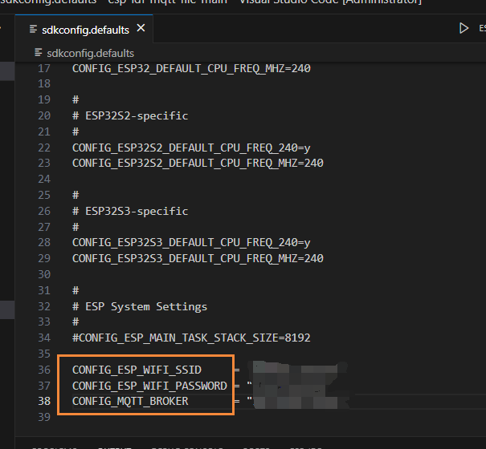
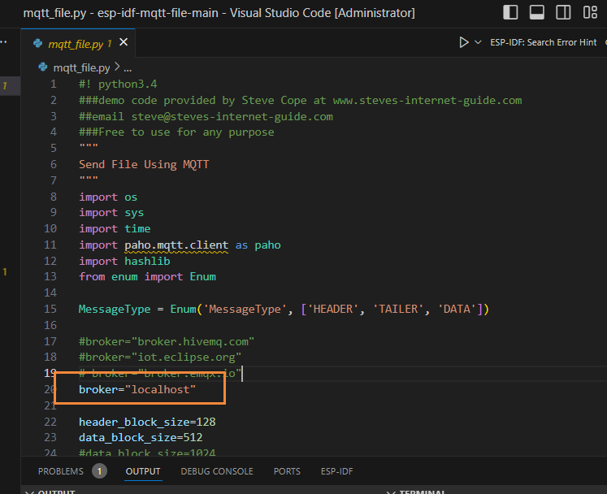

# CONFIG

配置 wifi ssid & pwd，配置 mqtt 服务器地址



# Python

安装mqtt 库：

```
pip install paho-mqtt
```

更改测试脚本中的 mqtt 服务器地址：



测试上传和枚举：

```
# Put README.md to SPIFFS
$ python3 mqtt_file.py put README.md

# SPIFFS file list
$ python3 mqtt_file.py list
```

