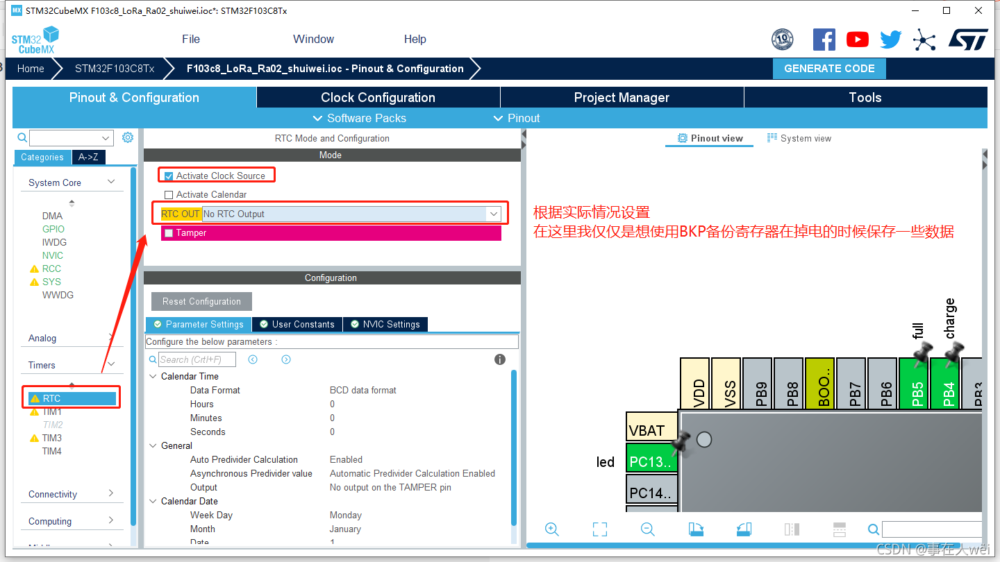

# 备份寄存器

1. 开启RTC功能



2. API调用

初始化程序已经自动生成好了,直接使用下面的两个函数就可以了

将num数据保存在RTC_BKP_DR1的位置

```c
uint16_t num = 0x25;
HAL_RTCEx_BKUPWrite(&hrtc,RTC_BKP_DR1,num);
```

在RTC_BKP_DR1的位置读取数据

```c
uint16_t num = 0;
num = HAL_RTCEx_BKUPRead(&hrtc,RTC_BKP_DR1);
```

3.  参考资料


> VBAT引脚需要连接备用电池, 如果VBAT引脚掉电了, BKP的数据也会丢失

