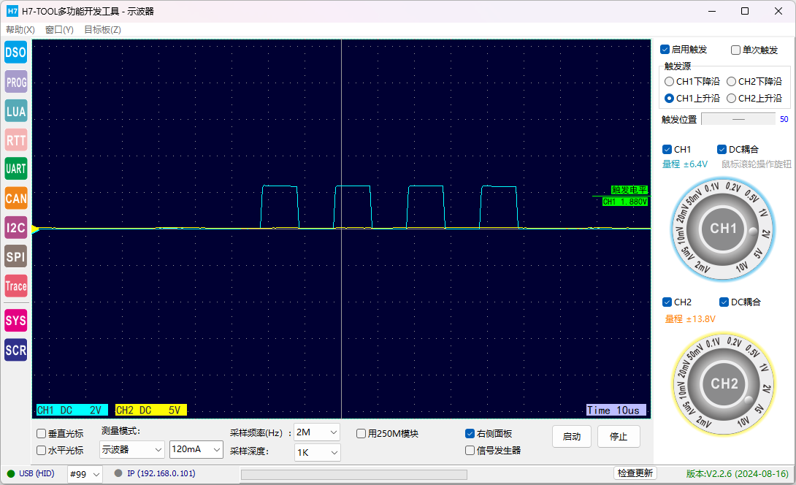

[STM32H7的DMAMUX的定时器触+DMA双缓冲控制任意IO做PWM和脉冲数控制](https://www.armbbs.cn/forum.php?mod=viewthread&tid=125391&extra=page%3D1)

（原理：使用定时器触发 DMA，将 预设的IO状态数组 搬运到 GPIO的端口位设置/清除寄存器上）

* 第1次DMA NORMAL的第1次发脉冲时间有点短

* 再发一个DMA NORMAL的脉冲就正常了。

