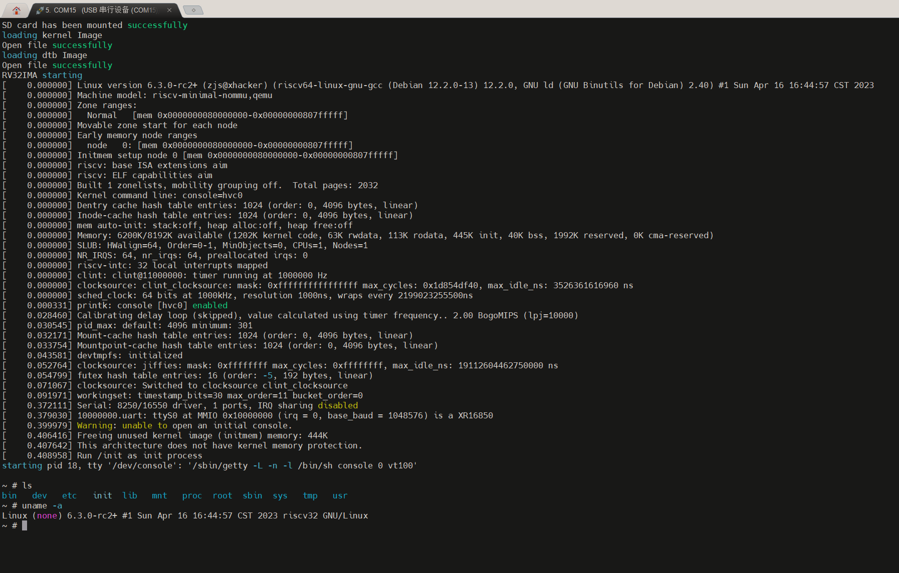

# hpm_rv32ima
参考 [CNLohr's mini-rv32ima](https://github.com/cnlohr/mini-rv32ima) 以及 [uc-rv32ima](https://github.com/xhackerustc/uc-rv32ima.git)  感谢大佬开源。

验证hpmicro运行Linux的可能性

## How it works

- 准备一张文件系统为 FAT32 的卡 ，把image里面的所有文件放在SD卡根目录。
- 编译烧录，linux 启动！！

