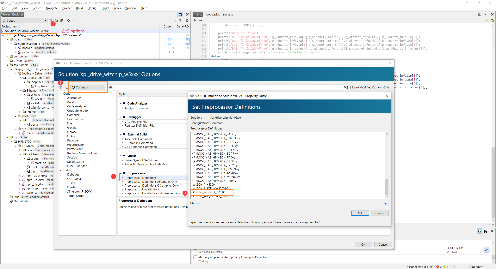
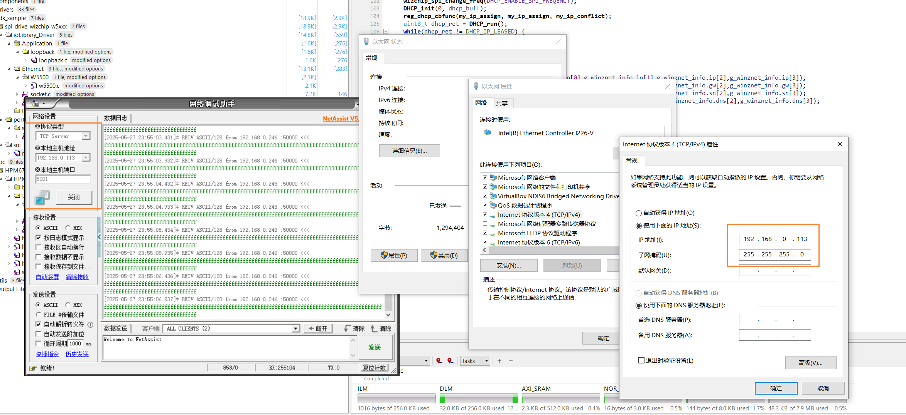
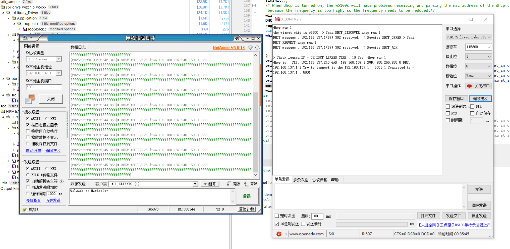
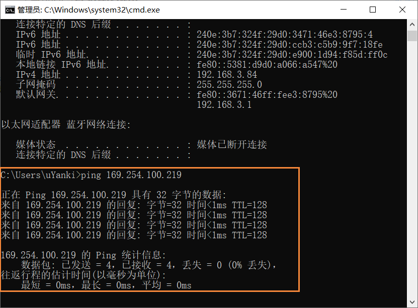
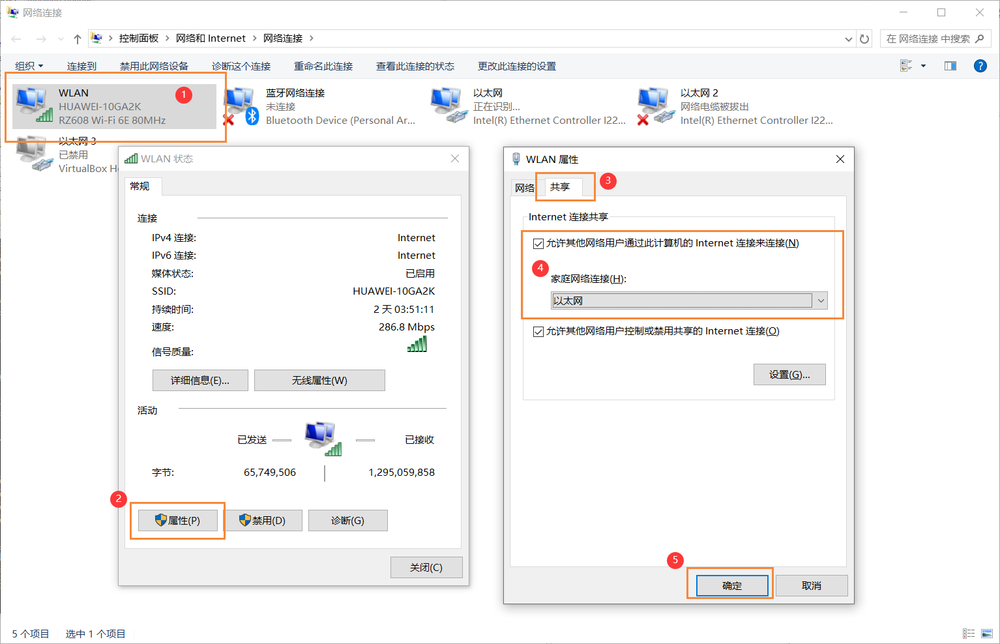

# W5xxx

[References](https://mp.weixin.qq.com/s/eh6ayiFqA0HTdbhU-fdseQ)

## DHCP

### CONFIG_WIZNET_DCHP = 0

设置静态 IP，开启 TCP 服务器

### CONFIG_WIZNET_DCHP = 1

#### Q&A

1. DCHP 分配不了 IP

确保能 ping 通

2. 确保 路由器/网口 具有 DCHP 功能

如电脑网口默认是没有 DCHP，此处开启 WLAN 的网络共享功能，让连接了 W5500 模块的以太网也具有 DCHP 功能。

