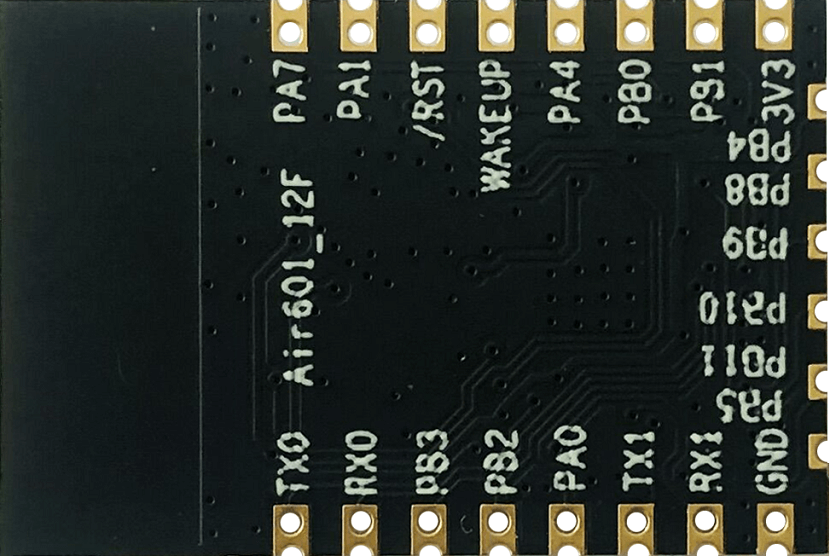
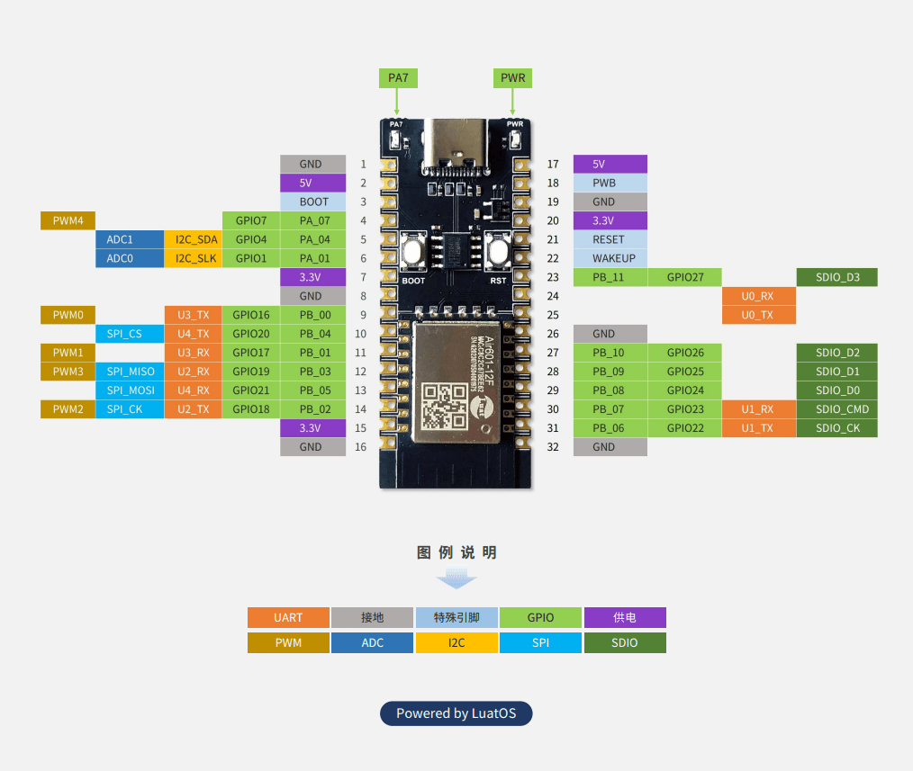

# [Air601-12F](https://wiki.luatos.com/chips/air601/index.html)

## Core

Air601集成32位riscv处理器，最高主频240MHz，内置1MB flash和288K SRAM（LuaOS可用94K）

拥有丰富的外设接口：

- GPIO*18
- UART*5 波特率最高可达2Mbps
- SPI*1
- I2C*1 LuatOS开发可使用多路软件I2C，支持任意引脚
- PWM*5
- ADC*2 16位采样，最高1K采样率
- SDIO*1

Wi-Fi 安全支持 Wi-Fi WMM/WMM-PS/WPA/WPA2/WPS；

支持20/40MHz带宽，最高支持150Mbps速率；

支持 Station 、Station + SoftAP 、SoftAP 模式；

支持TLS加密通信，硬件加密模块加速，支持多路TLS连接；

支持fota空中升级；

支持低功耗休眠，休眠电流小于20 μA

## Module

| 正面                                                         | 反面                                                         |
| ------------------------------------------------------------ | ------------------------------------------------------------ |
|  |  |

- Air601-12F 是合宙通信推出的 Wi-Fi - BLE二合一通信模块；
- Air601-12F采用合宙Air601芯片平台，支持Wi-Fi 802.11b/g/n协议，支持BLE 4.2协议；
- Air601-12F 兼容业内主流12F封装(SMD-22)，板载PCB天线，极致成本，满足小型化低成本需求；
- Air601-12F 支持AT指令开发，指令集兼容，可无缝替换。

## PinOut

开发板排针尺寸:

1. 管脚之间的距离, 10mil, 2.54mm
2. 两排管脚之间的距离, 700mil, 17.78mm

## [Fireware](https://pan.air32.cn/s/DJTr?path=%2F)

### V1021

1. 支持esptouch和airkiss配网,兼容腾讯连连
2. 修正wifi mac地址导致连接手机/电脑热点失败的问题
3. 支持TLS等加密链接, 默认固件未启用,可自行云编译
4. 支持更大Lua内存, 默认92k
5. 支持蓝牙功能,但需要与wifi分开使用, 不能同时启用

