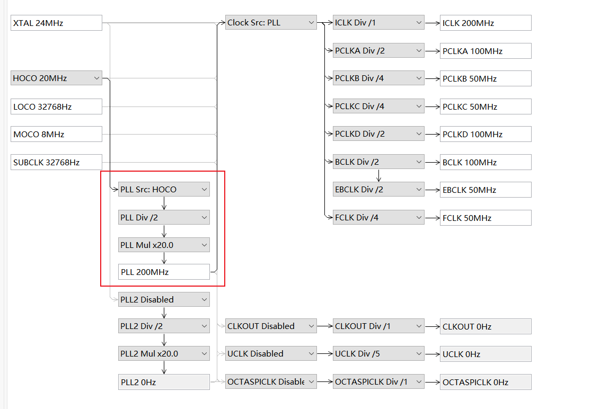

# FSP Configuration

## Clock

板子无外部晶振时，需选择高速片上振荡器作为时钟源！！（如卡在时钟初始化的位置，请检查该项）

| 时钟源                       | 描述                                         |
| ---------------------------- | -------------------------------------------- |
| Main Clock Oscillator (MOSC) | 主时钟振荡器（连接外部 8~24 MHz 高速晶振）   |
| Sub-Clock Oscillator (SOSC)  | 副时钟振荡器（连接外部 32.768 kHz 低速晶振） |
| HOCO                         | 高速片上振荡器                               |
| MOCO                         | 中速片上振荡器                               |
| LOCO                         | 低速片上振荡器                               |
| PLL                          | PLL输出                                      |
| PLL2                         | PLL2输出                                     |

