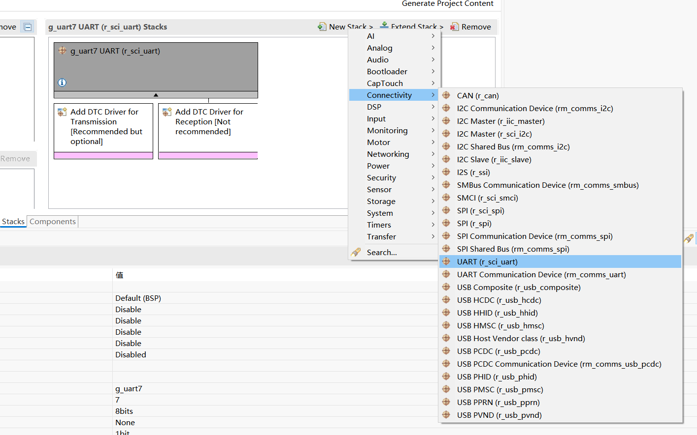
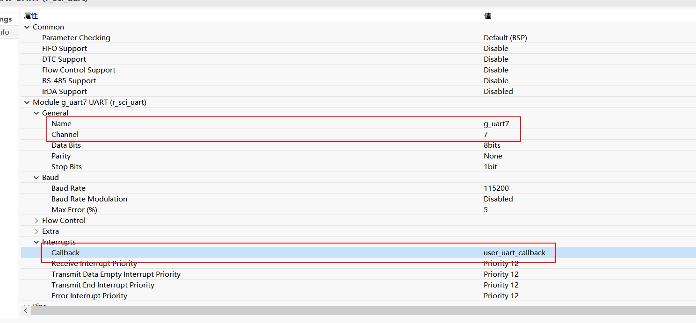
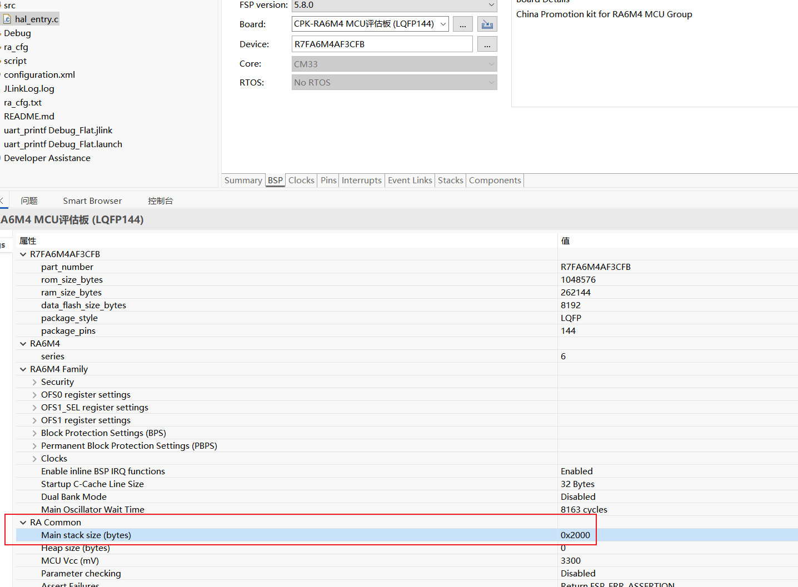
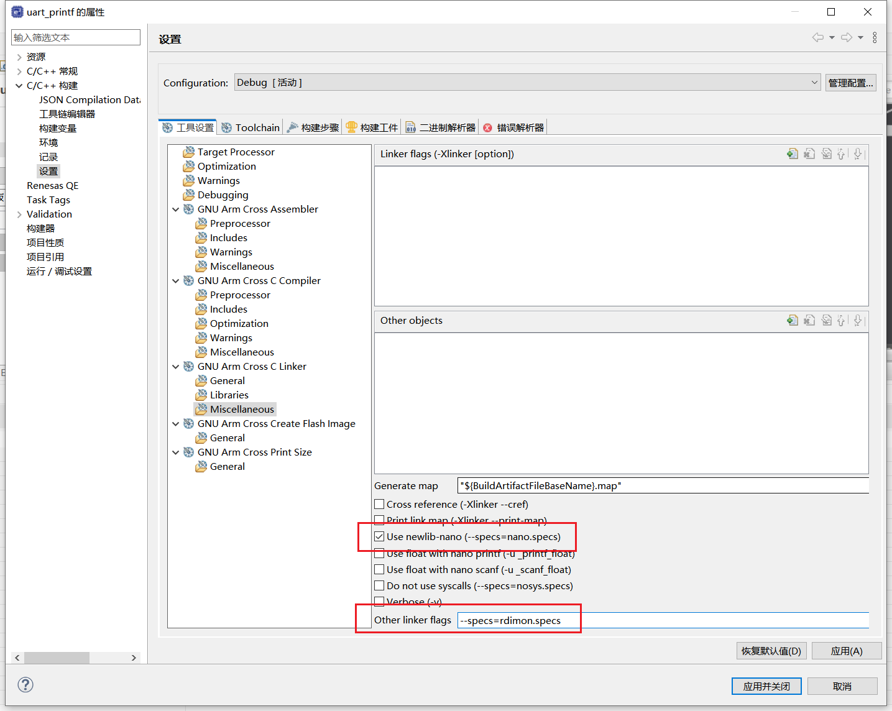

# FSP Configuration

## Stacks





## BSP



# Project Property



```
--specs=rdimon.specs
```

# User Code

```c
#include <stdio.h>

void hal_entry(void)
{
   fsp_err_t err = R_SCI_UART_Open(&g_uart7_ctrl, &g_uart7_cfg);
   assert(FSP_SUCCESS == err);

   int int_var = 24384903;
   float float_var = 3.141592f;
   char char_var = 22;

   while(1)
   {
        printf("hello world!\n");
        printf("int=%d\n",int_var);
        printf("float=%.2f\n",float_var);
        printf("char='%c'\n",char_var);
        R_BSP_SoftwareDelay(1000, BSP_DELAY_UNITS_MILLISECONDS);
   }
}


volatile bool uart_send_complete_flag = false;

void user_uart_callback (uart_callback_args_t * p_args)
{
    if(p_args->event == UART_EVENT_TX_COMPLETE)
    {
        uart_send_complete_flag = true;
    }
}


#ifdef __GNUC__                                 //串口重定向
    #define PUTCHAR_PROTOTYPE int __io_putchar(int ch)
#else
    #define PUTCHAR_PROTOTYPE int fputc(int ch, FILE *f)
#endif

PUTCHAR_PROTOTYPE
{
    fsp_err_t err = R_SCI_UART_Write(&g_uart7_ctrl, (uint8_t *)&ch, 1);
    if(FSP_SUCCESS != err) __BKPT();
    while(uart_send_complete_flag == false){}
    uart_send_complete_flag = false;

    return ch;
}

int _write(int fd,char *pBuffer,int size)
{
    for(int i=0;i<size;i++)
    {
        __io_putchar(*pBuffer++);
    }
    return size;
}
```

