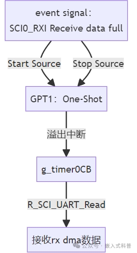
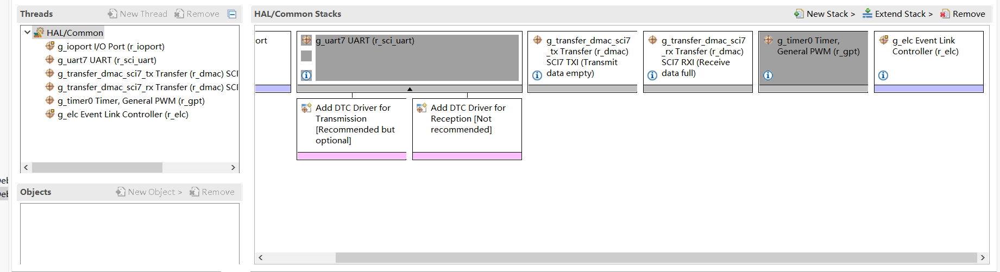
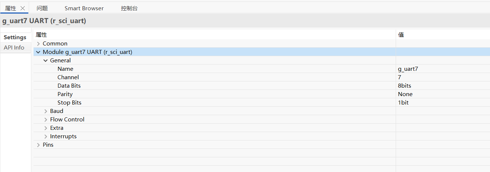
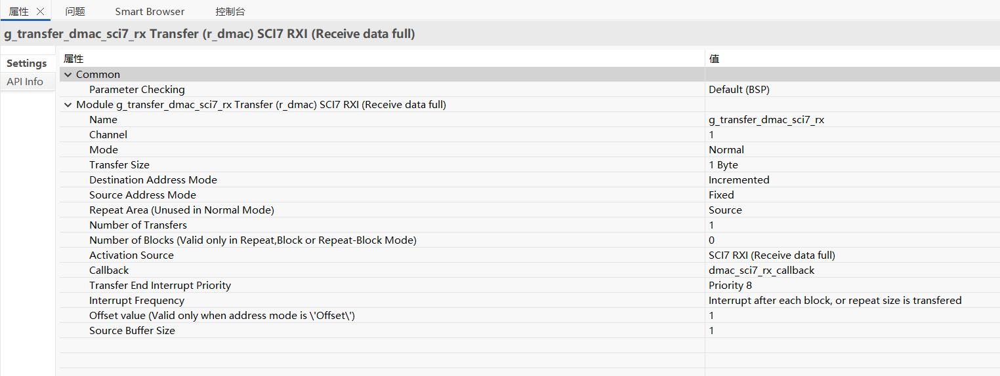
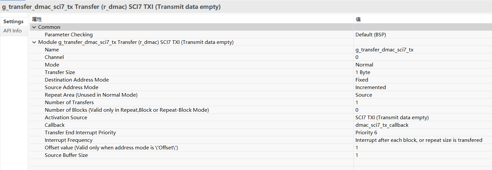
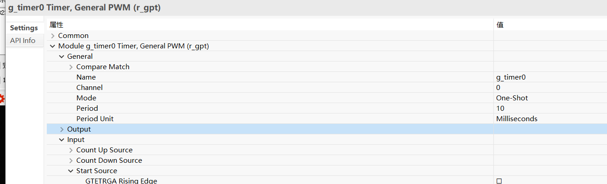
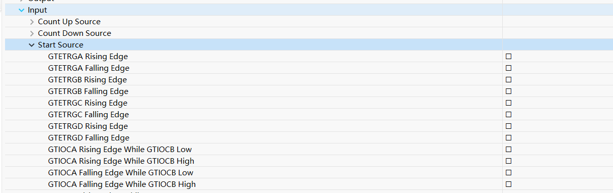
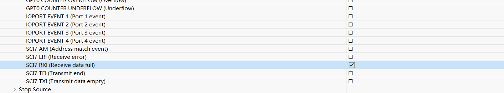
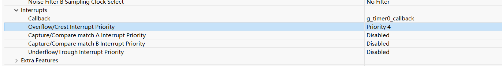

# 串口收发DMA+伪空闲中断



## FSP Configuration



### UART

默认参数即可。



### Rx DMA



触发源：SCI RXI

中断:选配。

### Tx DMA



触发源：SCI TXI

中断：选配。

### GPT



计数模式：One-Shot

超时时间：10ms (自定义)





计数触发：SCI RXI



中断：Overflow （计数器溢出中断即串口空闲中断）

## Code

```c

uint8_t rx_buf[256];

fsp_err_t R_SCI_UART_Write_DMA (uart_ctrl_t * const p_api_ctrl, uint8_t const * const p_src, uint16_t const bytes);
fsp_err_t R_SCI_UART_Read_DMA (uart_ctrl_t * const p_api_ctrl, uint8_t const * const p_dest, uint16_t const bytes);

/*******************************************************************************************************************//**
 * main() is generated by the RA Configuration editor and is used to generate threads if an RTOS is used.  This function
 * is called by main() when no RTOS is used.
 **********************************************************************************************************************/
void hal_entry(void)
{
    fsp_err_t err = FSP_SUCCESS;

#if 0//use api
    err = R_SCI_UART_Open (&g_uart7_ctrl, &g_uart7_cfg);
    assert(FSP_SUCCESS == err);
#else//use g_uart7 handler
    g_uart7.p_api->open(g_uart7.p_ctrl, g_uart7.p_cfg);
    assert(FSP_SUCCESS == err);
#endif

    g_timer0.p_api->open(g_timer0.p_ctrl, g_timer0.p_cfg);
    g_timer0.p_api->enable(g_timer0.p_ctrl);

    g_elc.p_api->open(g_elc.p_ctrl, g_elc.p_cfg);
    g_elc.p_api->enable(g_elc.p_ctrl);

    // dma init
    err = g_transfer_on_dmac.open(g_transfer_dmac_sci7_tx.p_ctrl, g_transfer_dmac_sci7_tx.p_cfg);
    assert(FSP_SUCCESS == err);
    err = g_transfer_on_dmac.enable(g_transfer_dmac_sci7_tx.p_ctrl);
    assert(FSP_SUCCESS == err);
    err = g_transfer_on_dmac.open(g_transfer_dmac_sci7_rx.p_ctrl, g_transfer_dmac_sci7_rx.p_cfg);
    assert(FSP_SUCCESS == err);
    err = g_transfer_on_dmac.enable(g_transfer_dmac_sci7_rx.p_ctrl);
    assert(FSP_SUCCESS == err);

    // dma tx
    const char* test = "hello world";
    R_SCI_UART_Write_DMA(g_uart7.p_ctrl, (uint8_t *)test, (uint16_t)strlen(test));

    // dma rx
    R_SCI_UART_Read_DMA(g_uart7.p_ctrl, rx_buf, sizeof(rx_buf));

    while(1);

#if BSP_TZ_SECURE_BUILD
    /* Enter non-secure code */
    R_BSP_NonSecureEnter();
#endif
}

fsp_err_t R_SCI_UART_Write_DMA (uart_ctrl_t * const p_api_ctrl, uint8_t const * const p_src, uint16_t const bytes)
{
    /* SCI SCR register bit masks */
    #define SCI_SCR_TEIE_MASK                       (0x04U) ///< Transmit End Interrupt Enable
    #define SCI_SCR_RE_MASK                         (0x10U) ///< Receive Enable
    #define SCI_SCR_TE_MASK                         (0x20U) ///< Transmit Enable
    #define SCI_SCR_RIE_MASK                        (0x40U) ///< Receive Interrupt Enable
    #define SCI_SCR_TIE_MASK                        (0x80U) ///< Transmit Interrupt Enable

    fsp_err_t err = FSP_SUCCESS;

    sci_uart_instance_ctrl_t * p_ctrl = (sci_uart_instance_ctrl_t *) p_api_ctrl;

    //Before initiating DMA transfer, must be clear it first.
    R_ICU->IELSR[SCI7_TXI_IRQn] = 0U;

    /* Transmit interrupts must be disabled to start with. */
    p_ctrl->p_reg->SCR &= (uint8_t) ~(SCI_SCR_TIE_MASK | SCI_SCR_TE_MASK);

    //dma config
    g_transfer_dmac_sci7_tx.p_cfg->p_info->p_src = (void*)&p_src[0];
    g_transfer_dmac_sci7_tx.p_cfg->p_info->p_dest = (void*)&R_SCI7->TDR;
    g_transfer_dmac_sci7_tx.p_cfg->p_info->length = bytes;

    err = g_transfer_dmac_sci7_tx.p_api->reconfigure(g_transfer_dmac_sci7_tx.p_ctrl, g_transfer_dmac_sci7_tx.p_cfg->p_info);

    /* Trigger a TXI interrupt. This triggers the transfer instance or a TXI interrupt if the transfer instance is
         * not used. */
    p_ctrl->p_reg->SCR |= (SCI_SCR_TIE_MASK | SCI_SCR_TE_MASK);

    return err;

}

fsp_err_t R_SCI_UART_Read_DMA (uart_ctrl_t * const p_api_ctrl, uint8_t const * const p_dest, uint16_t const bytes)
{
    /* SCI SCR register bit masks */
    #define SCI_SCR_TEIE_MASK                       (0x04U) ///< Transmit End Interrupt Enable
    #define SCI_SCR_RE_MASK                         (0x10U) ///< Receive Enable
    #define SCI_SCR_TE_MASK                         (0x20U) ///< Transmit Enable
    #define SCI_SCR_RIE_MASK                        (0x40U) ///< Receive Interrupt Enable
    #define SCI_SCR_TIE_MASK                        (0x80U) ///< Transmit Interrupt Enable

    fsp_err_t err = FSP_SUCCESS;

    sci_uart_instance_ctrl_t * p_ctrl = (sci_uart_instance_ctrl_t *) p_api_ctrl;

    //Before initiating DMA transfer, must be clear it first.
    R_ICU->IELSR[SCI7_RXI_IRQn] = 0U;

    /* Transmit interrupts must be disabled to start with. */
    p_ctrl->p_reg->SCR &= (uint8_t) ~(SCI_SCR_RIE_MASK | SCI_SCR_RE_MASK);

    // dma config
    g_transfer_dmac_sci7_rx.p_cfg->p_info->p_src = (void*)&R_SCI7->RDR;
    g_transfer_dmac_sci7_rx.p_cfg->p_info->p_dest = (void*)&p_dest[0];
    g_transfer_dmac_sci7_rx.p_cfg->p_info->length = bytes;

    err = g_transfer_dmac_sci7_rx.p_api->reconfigure(g_transfer_dmac_sci7_rx.p_ctrl, g_transfer_dmac_sci7_rx.p_cfg->p_info);

    /* Trigger a TXI interrupt. This triggers the transfer instance or a TXI interrupt if the transfer instance is
         * not used. */
    p_ctrl->p_reg->SCR |= (SCI_SCR_RIE_MASK | SCI_SCR_RE_MASK);

    return err;

}

void g_timer0_callback(timer_callback_args_t *p_args)
{
    if(p_args->event == TIMER_EVENT_CYCLE_END)
    {
        transfer_properties_t p_info;

        R_DMAC_InfoGet(g_transfer_dmac_sci7_rx.p_ctrl, &p_info);

        R_SCI_UART_Write_DMA(g_uart7.p_ctrl, rx_buf, (uint16_t)(sizeof(rx_buf) - p_info.transfer_length_remaining));

        R_SCI_UART_Read_DMA(g_uart7.p_ctrl, rx_buf, sizeof(rx_buf));
    }

}

void dmac_sci7_tx_callback(transfer_callback_args_t *p_args)
{
    (void) p_args;
}

void dmac_sci7_rx_callback(transfer_callback_args_t *p_args)
{
    (void) p_args;
}
```

