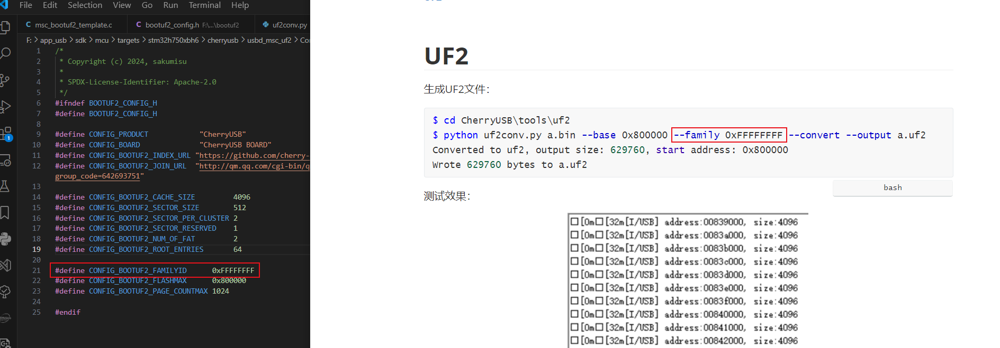

[TOC]

# UF2

生成UF2文件：

```bash
$ cd CherryUSB\tools\uf2
$ python uf2conv.py a.bin --base 0x800000 --family 0xFFFFFFFF --convert --output a.uf2
Converted to uf2, output size: 629760, start address: 0x800000
Wrote 629760 bytes to a.uf2
```

测试效果：


注：此处的 family 值需要对应上



