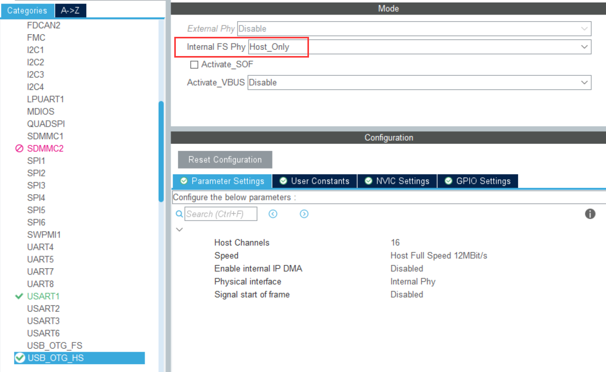
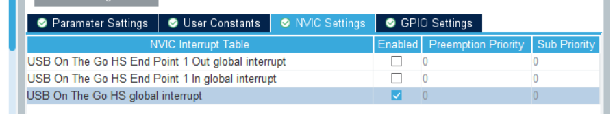
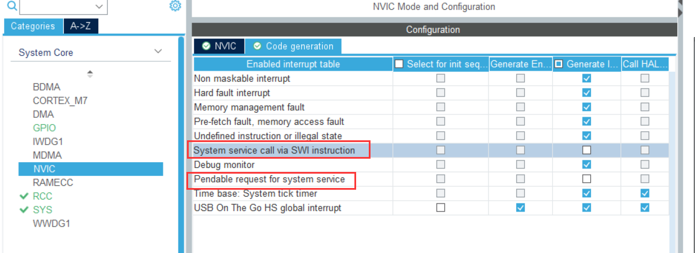
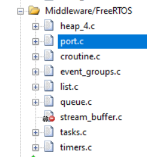
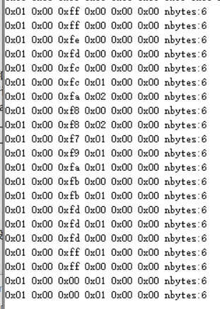
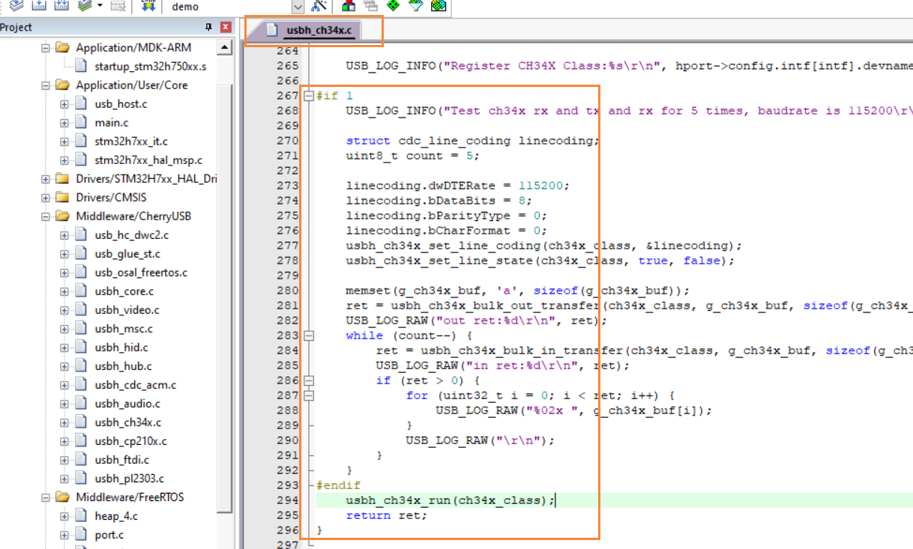
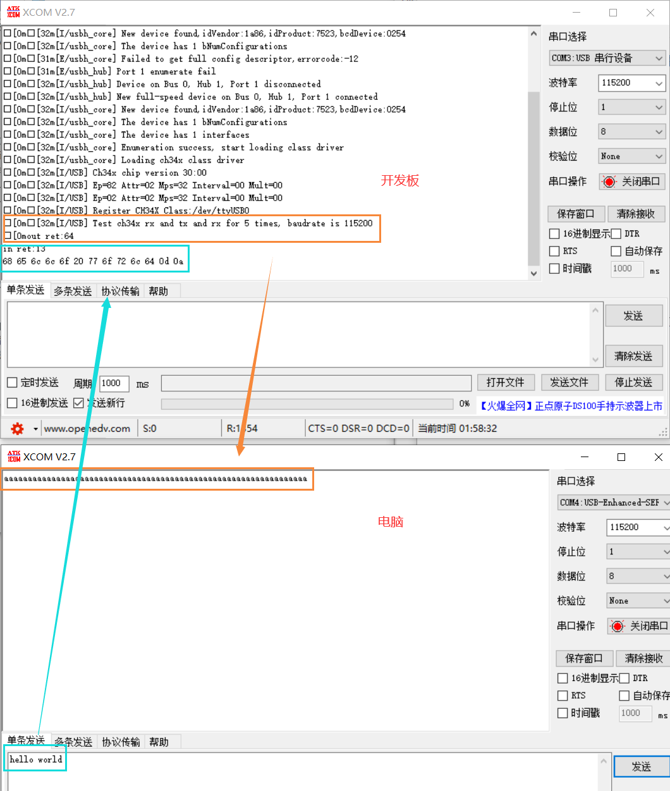

# USB 主机

主机使用了操作系统抽象层（osal），当前工程以 FreeRTOS 为例。

## 初始化

1. 选择内部 phy 及启用中断

让生成的代码不调用USB初始化函数

2. 硬件初始化

注意，此处是使用主机 `usb_hc`，不是从机 `usb_dc`

## 中断相关

1. 不生成 SVC 和 PendSV 中断

2. 操作系统时钟

3. USB 时钟

## 导入源文件

1. 导入 USB 相关文件

2. 导入操作系统相关文件

## 测试现象

### KeyBoard

### Mouse

### CH340

准备2个CH340，一个接到开发板上，一个接到电脑上。

启用测试代码：

互相收发：

