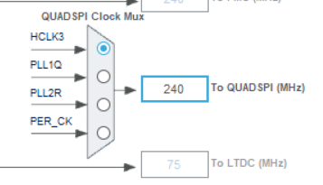
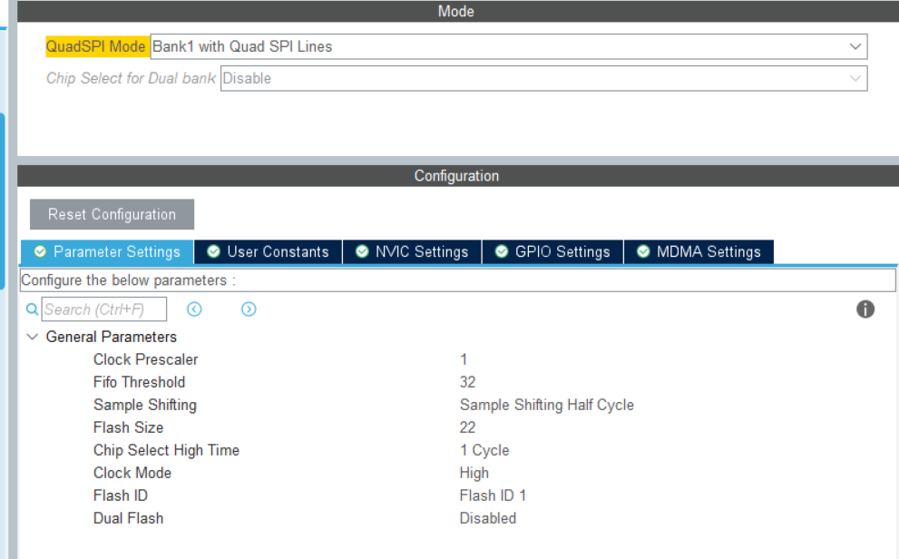

[TOC]

# 大容量储存设备

## CubeMx

### 设备模式


### USB 时钟源


### Keil


#### 优化等级

不同编译器，不同编译优化等级下，电脑能否识别到 U盘

> `-` 未测试，`√` 可以识别，`×` 无法识别

|      | AC5  | AC6  |
| ---- | ---- | ---- |
| O0   | √    | √    |
| O1   | √    | ×    |
| O2   | √    | ×    |
| O3   | √    | ×    |


#### fafts 

> 至少 512 个扇区，每隔扇区大小至少 512 字节


# QSPI Flash

#### GPIO

* Speed：VeryHigh


#### Clock



#### QuadSPI



* ClockPrescaler

W25Q64JV 最高驱动频率为 133MHz。

此处选择 240MHz 的 HCLK3 作为 QSPI 的内核时钟，经过2分频后得到 120MHz 的 QSPI 通信驱动时钟。

* ChipSelectHighTime

片选保持高电平的时间。

* FlashSize

> 计算公式：2^[FSIZE+1] = 容量（字节数）

W25Q64 的容量为 8M 字节，即 8\*1024\*1024=2\^(22+1)。

* SampleShifting

数据采样时刻，此处选择 半个CLK周期之后进行采样。

#### QSPI Command

上电时，可用单线 SPI 模式读取 状态寄存器2 的QE位是否为1。如果不为1，需先通过单线模式发送 0x38 指令启动 QSPI 模式，才能通过四线 QSPI 读写数据。

```c
QSPI_CommandTypeDef sCommand = {0};

// QSPI 单线 (标准SPI)
sCommand.InstructionMode  = QSPI_INSTRUCTION_1_LINE;
sCommand.AddressMode      = QSPI_ADDRESS_1_LINE;
sCommand.DataMode         = QSPI_DATA_1_LINE;

// QSPI 四线
sCommand.InstructionMode  = QSPI_INSTRUCTION_4_LINES;
sCommand.AddressMode      = QSPI_ADDRESS_4_LINES;
sCommand.DataMode         = QSPI_DATA_4_LINES;

// ... 多种组合模式
```

### W25Q Read Inst


读指令 Fast Read Quad I/O (EBh)

* 传输线：`1-4-4` 为，1指令线，1地址线，4数据线
* 时序：在地址传输完成后，要等3个字节，每个字节传输需要2个时钟周期，即6个时钟周期才能接收到数据。


> 读取数据时，若发现有些地方读出来为0x00，可能时 Dummy 没设置对导致的。
>
> ```c
> QSPI_CommandTypeDef sCommand = {0};
> sCommand.DummyCycles = ...
> ```

#### W25Qxx 内存映射模式

1. 需关闭 MPU 才能正常读，并且开启 Cache 能显著提升读写速度。（该模式下不可写）


2. 映射地址

QSPI Flash 映射到内存地址是 0x9000 0000，芯片内部flash地址是 0x0800 0000。


> 注：QSPI FLASH 寻址空间不能大于256MB，但是QSPI FLASH芯片可以大于256MB。


### MSC

#### 双盘符


