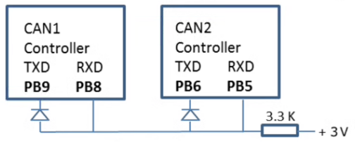
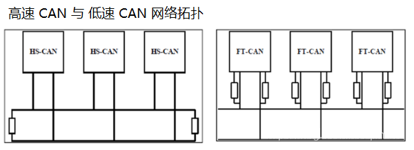
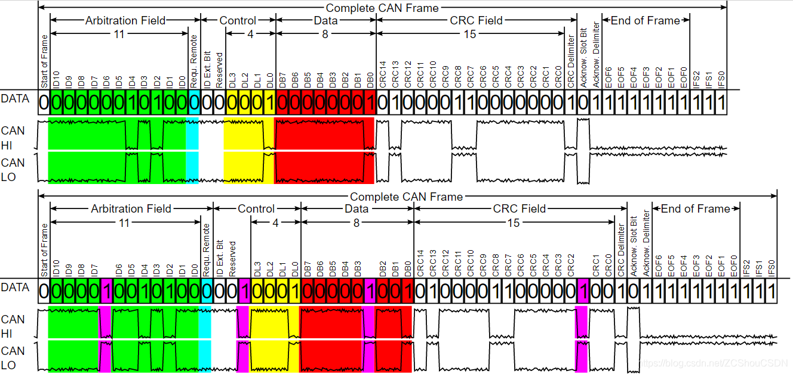
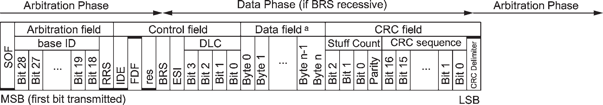

# CAN

Controller Area Network：控制器局域网络（半双工）

CAN（Classic CAN）

* CAN 2.0A：仅支持标帧，丢弃扩展帧但不会报错
* CAN 2.0B：支持标准帧和扩展帧

CAN FD：仲裁段比特率和 CAN 相同，最高 1Mbps。数据比特率常用 5Mbps。

#### Level

注：示波器单探头可捕获 CAN 波形，钩子段夹 CANH，架子端夹 CANL。（待测）

| CAN_H | CAN_L | diff | Logic  |                       |
| ----- | ----- | ---- | ------ | --------------------- |
| 3.5V  | 1.5V  | 2V   | 逻辑 0 | 显性电平（Dominant）  |
| 2.5V  | 2.5V  | 0V   | 逻辑 1 | 隐性电平（Recessive） |

总线仲裁规则：线与。

| 有0              | 则0        | ，   | 全1              | 则1        |
| ---------------- | ---------- | ---- | ---------------- | ---------- |
| 节点输出的逻辑值 | 总线逻辑值 |      | 节点输出的逻辑值 | 总线逻辑值 |
#### Baudrate

波特率：所有节点的波特率需一致。

---

不用 CAN-PHY 的接法：

- 单个 TXD 输出低电平（0），总线就为显性，RXD 就会接收到低电平（0）。

- 全部 TXD 输出高电平（1），总线才为隐性，RXD 才会接收到高电平（1）。

### 帧格式（Frame Format）

数据帧（Data Frame）：向其它节点发送数据

遥控帧/遥控帧（Remote Frame）：请求其他节点发送指定标识符的数据帧

错误帧（Error Frame）：通知其他节点自己检测到总线错误

过载帧（Overload Frame）：通知其他节点自己尚未做好接收准备

帧间隔（Interframe Space）：每两帧之间需要有帧间隔，错误帧和过载帧除外

#### 数据帧（Data Frame）

标志帧：

.png)

扩展帧：

---

**总线空闲**（Bus Idle）：N_1

**帧起始**（Start of Frame，**SOF**）：1_0

**仲裁段**（Arbitration Field）

* 标识符（Identifier，**ID**）：11_X

报文 ID 越小，报文优先级越高。

每个节点发送的同时，也会读取总线上的数据。若发1读0则退出仲裁。

注：若同时启动具有相同 ID 的数据帧和远程帧，则数据帧优先传输。

* 远程帧（Remote Transmission Request，**RTR**）：数据帧 1_0，遥控帧 1_1
* 远程代替请求（Substitute Remote Request，**SSR**）/（Remote Request Substitution，**RRS**）：1_1

**控制段**（Control Field）

* 标识符扩展（Identifier Extension，**IDE**）：1_X
  * 0：标志 ID（Standard ID）=> 11-bit 
  * 1：扩展 ID（Extended ID）=> 29-bit = 11 + 18

标准帧比扩展帧优先，因为位 0 赢得仲裁。

ID 的高位比特优先传输，再传输低位比特。

* 保留位（Reverse，**r/r1/r2**）：1_0，该位默认显性，隐性用于扩展。
* 数据长度（Data Length Code，**DLC**）：4_X

字节个数：

| DLC（Dec） | 0    | 1    | 2    | 3    | 4    | 5    | 6    | 7    | 8    | 9    | 10   | 11   | 12   | 13   | 14   | 15   |
| :--------: | ---- | ---- | ---- | ---- | ---- | ---- | ---- | ---- | ---- | ---- | ---- | ---- | ---- | ---- | ---- | ---- |
|  CAN 2.0   | 0    | 1    | 2    | 3    | 4    | 5    | 6    | 7    | 8    | 8    | 8    | 8    | 8    | 8    | 8    | 8    |
|   CAM-FD   | 0    | 1    | 2    | 3    | 4    | 5    | 6    | 7    | 8    | 12   | 16   | 20   | 24   | 32   | 48   | 64   |

---

`CAN FD`：

* 帧类型（**FDF**）：用于区分当前帧是 经典 CAN 帧（1_1）还是 CANFD 帧（1_0）。 

对应经典 CAN 标准帧中的 R0 位，扩展帧的 R1 位。

* 保留位（Res）：1_0
* 切换比特率（**BRS**）：1_X

为 1：比特率应从仲裁段的标准比特率切换到数据段的预配置数据比特率。

单个网络中的所有 CANFD 帧中的 BRS 位不需要相同。

* 错误标志（ESI）：错误主动节点：1_0，错误被动节点：1_1。

---

**数据段**（Data Field）：0 ~ 64 位

**校验段**（Cyclic Redundancy Check Sequence，**CRC**）

* 校验值：Classic CAN：15_X，CAN-FD：17_X / 21_X

计算范围：起始帧，仲裁段，控制段，数据段

CAN-FD：低于 16 字节的使用 CRC17，高于 16 字节的使用 CRC 32。

* 界定符（CRC Delimiter）：1_1

---

`CANFD`：

* 填充位计数（Stuff bit Count，**SBC**）：4_X

位填充的个数 模 8 对应的格雷码（3-bit） + 奇偶校验位（1-bit）

| n                         |      |      |      |      |      |      |      |      |
| ------------------------- | ---- | ---- | ---- | ---- | ---- | ---- | ---- | ---- |
| stuff bit count modulo 8  | 0    | 1    | 2    | 3    | 4    | 5    | 6    | 7    |
| gray-code with parity bit | 0000 | 0011 | 0110 | 0101 | 1100 | 1111 | 1010 | 1001 |

位填充的个数：从帧起始算到CRC界限符。

奇偶校验位：格雷码为偶数，该位就为 0；为奇数，该位就为 1。

！！！CANFD 的 CRC 值中的首位及其后的每4个位都插入个1个固定填充位（fixed stuff bit），该位的填充值与前一位的值相反。（如 CRC 值前恰好是 5个连续的比特，这只填1个填充位，即不能由有连续的两个填充位 ）

---

以下是单个示波器探头测的经典帧和CANFD帧。

品红色的线：高的代表0，低的代表1.

绿色掩码：该位位填充位。

CAN ID = 0x211，DLC = 3，仲裁段和数据段使用相同的波特率。

---

**应答段**（Acknowledgement Field，**ACK**）

* 应答槽（ACK Slot）：1_X

发送节点将应答槽置 1，若接收节点的 CRC 校验成功则会将应答槽置 0。

当发送节点检测到 0，就表明至少 1 个节点成功接收。

* 限定符（Ack Delimiter）：1_1

---

CAN FD 到该段就代表变波特率结束。

---

**帧结束**（End of Frame，**EOF**）：7_1

**间歇场**（Intermission，**ITM**）：3_1

间歇起降不允许发送数据帧或遥控帧，但可以发送错误帧或过载帧。

#### 遥控帧

与数据帧不同点：RTR 位的逻辑电平相反，无数据段（Data Field）

#### 错误帧（Error Frame）

注：主动错误$\neq$主动报错，被动错误$\neq$被动报错。它们是段出错标识，是段 `错误的位序列` （不满足位填充的规则）。

**错误标志**（Error Flag）：

* 主动错误标志（Active Error Flag）：6_0 

该错误帧的会覆盖其他帧，导致所有节点都检测到位填充错误。

* 被动错误标志（Passive Error Flag）：6_1

该错误帧的可能会被其他帧覆盖。被设计来减小网络上故障节点的负面影响。

**错误叠加标志**（Error Delimiter）：0~6_0

**错误界定符**：8_1

---

故障界定状态机制：

寄存器：

* 接收错误计数器（Receive error counter，REC）

* 发送错误计数器（Transmit error counter，TEC）

不同值对于不同状态：

* 主动错误：REC < 127 且 TEC < 127。发送主动错误标志

* 被动错误：REC > 127 或 TEC > 127。发送被动错误标志

* 总线关闭（Bus Off）：TEC > 255。脱离总线。

CAN 控制器复位时，REC 和 TEC 都会被清 0。

主动错误 和 被动错误 间的状态转换由 CAN 控制器自动切换。

被动错误 转 总线关闭，或 总线关闭 转 主动错误 由应用程序负责切换。

总线关闭 转 主动错误 的 自动上线条件：检测到 128 次 11 位连续的隐性位。

节点往总线发报文，但不知道什么原因导致发送不出去，把该发哦是那个错误计数累计到 255（发送错误+8，发送失败-1），会进入 BusOff 模式。随后进入快恢复模式，连续 N 次（由厂家定的），进入慢恢复模式。

注：快慢恢复，即进入 busoff 后，重新初始化 CAN，并等待一定的时间后（tBusOffQuick  或 tBusOffSlow），重新使能报文发送。发送成功，则表示 busoff 恢复成功。

---

#### 过载帧（Overload Frame）

某个节点忙，

CRC 错误：校验失败

格式错误：检测带非法位

Q：节点如何知道何时发送数据？

A：CAN 控制器会持续监控总线。当接收到11个及以上的空闲位数时（在 ACK 位之后），参与总线仲裁，更具仲裁结果决定是否进行数据传输。

Q：发送出错怎么办？

包括发送节点在内的所有节点，都会监视总线上是否有其他节点用过将总线保持在逻辑0的方式向其他节点发出错误信号至少6个总线周期。

除发送节点和处于总线关闭状态的节点，都处于监听状态。

（先发的高位，还是再发的低位）

发送节点在检测到 5 个连续相同逻辑值的位时，有硬件自动在位流中插入 以一个逻辑值相反的位，以用于信号同步。(起始帧和报文ID连续5位相同呢？) 仅仅ID?

广播机制，硬件的本地过滤

#### 终端电阻

#### 位填充（bit stuffing）

**数据帧和远程帧 **中的 **起始帧、仲裁段、控制段及CRC序列** 都需要进行 **位填充**（不归零法，Non-Return-to-Zero，NRZ），即发送器在要发送的比特流中检测到**相同的5个连续比特**时（等值连续位），就会自动在实际发送的比特流中**插入1个相反的比特位**。接收器在接数的过程中自动提剔除填充位。**数据帧和远程帧 **中的 **CRC 界定符、应答段、结束帧** ，及 **错误帧、过载帧** 是固定的格式，不需要位填充。

（紫色：填充的位）

#### 帧结构对比

1. Classic CAN 标准帧结构

2. Classic CAN 扩展帧结构

3. CANFD 标准帧结构（DLC <=16）

4. CANFD 标准帧结构（20<=DLC <=64），**CRC 长度**

5. CANFD 扩展帧结构（DLC <=16）

6. CANFD 扩展帧（20<=DLC <=64）

