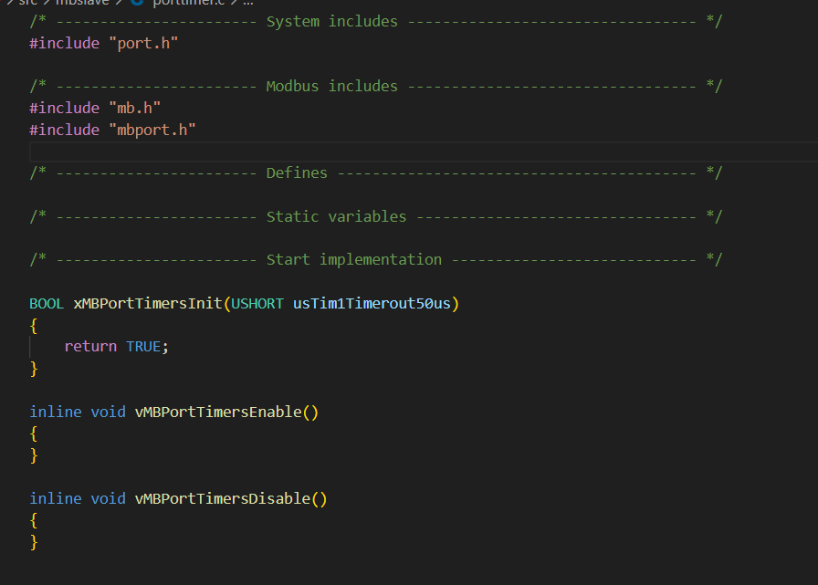
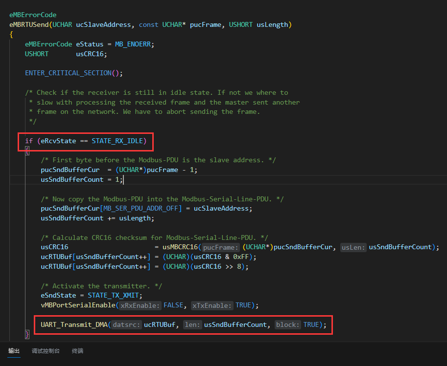

`bsp/uart.c`

串口空闲中断 + DMA 收发 + printf 闭包（RS485 流向控制）

### modbus_dma

* `porttimer.c`

不使用定时器断帧，使用串口空闲中断断帧。

* `mbrtu.c`

去除所有状态机：

帧发送前提：`eRcvState` 需为 `STATE_RX_IDLE`。

DMA 传输完成后启用串口传输中断，并将 `eRcvState` 设为 `STATE_RX_IDLE` 以允许发送帧。

串口空闲中断中处理接收到的数据帧，并往事件队列添加帧处理请求`xMBPortEventPost(EV_FRAME_RECEIVED)`。

