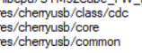
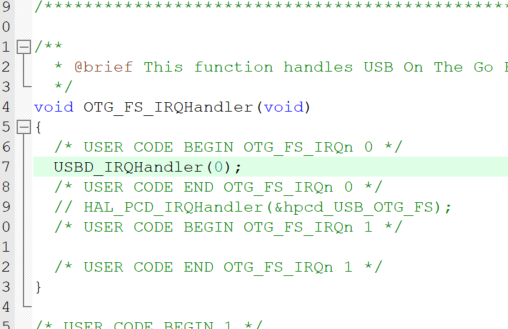

[TOC]

# 虚拟串口 

## CubeMX

### 时钟配置


### USB配置

设备模式 + USB中断


## 移植过程

### 协议栈导入

添加配置文件


添加以下头文件路径至项目



添加以下源文件至项目


* 根据芯片系列的选择底层接口

`middlewares\cherryusb\port\fsdev\README.md`


 `middlewares\cherryusb\port\dwc2\README.md` 


### 接口配置

* 初始化 `main.c` 

```c
void usb_dc_low_level_init(void)
{
	MX_USB_OTG_FS_PCD_Init();
}

void usb_dc_low_level_deinit(void){}
```

* 中断函数 `stm32h7xx_it.c` 



```c
extern void USBD_IRQHandler(uint8_t busid);
USBD_IRQHandler(0);
```

## 测试例程

1. 导入模板


2. 添加测试代码


```c
cdc_acm_init(0, USB_OTG_FS_PERIPH_BASE);
cdc_acm_data_send_with_dtr_test(0);
HAL_Delay(500);
```

3. 测试效果


4. 附加说明

例程默认只有勾选 DTR 时，MCU 才会发送数据。

若想不勾选  DTR 时，MCU 也发送数据，需屏蔽 DTR 状态检测：

