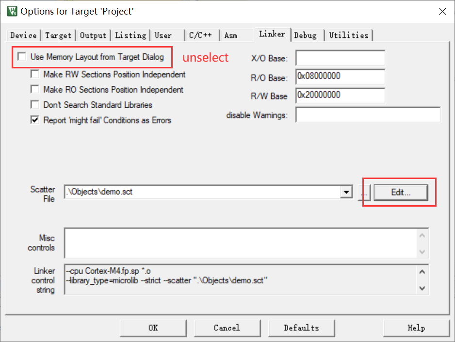
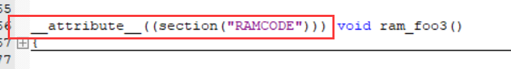
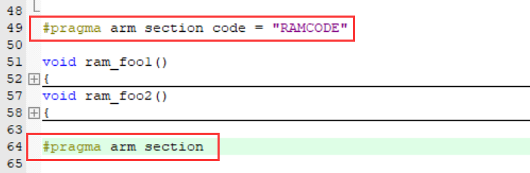
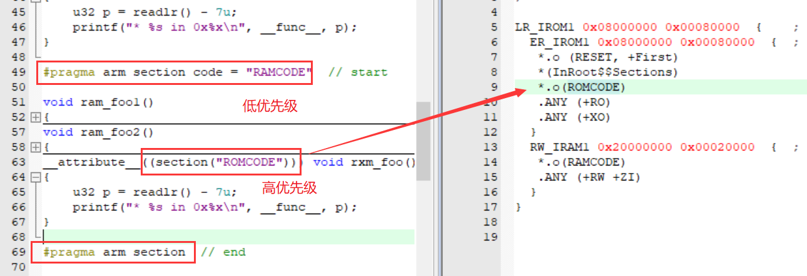
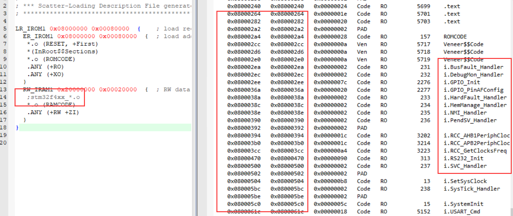
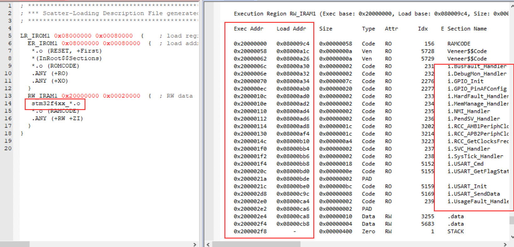
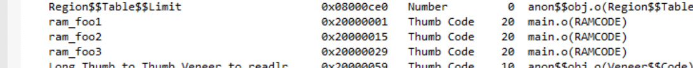
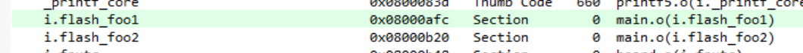
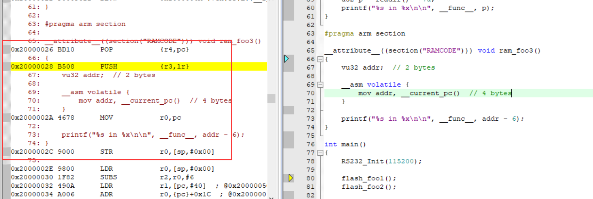

### Code In RAM

#### 实现方法




##### 单个函数

```
__attribute__((section("RAMCODE")))
```



##### 多个函数

```
#pragma arm section code = "RAMCODE" // start
#pragma arm section // end
```



注：同时修饰时，最终存放在 `__attribute__` 所修饰的段处。



##### 整个文件

Load Addr：加载地址，ROM

Exec Addr：执行地址，ROM(0x800...) / RAM(0x200...)





---

#### 编译结果（.map）

函数实际地址：






#### 运行结果

```
* flash_foo1 in 0x8000afc
* flash_foo2 in 0x8000b20
* ram_foo1 in 0x20000000
* ram_foo2 in 0x20000014
* ram_foo3 in 0x20000028
* rxm_foo in 0x80002a4
- flash_foo1 = 0x08000afd
- flash_foo2 = 0x08000b21
- ram_foo1 = 0x20000001
- ram_foo2 = 0x20000015
- ram_foo3 = 0x20000029
- rxm_foo = 0x080002a5
```

#### 汇编说明

##### 取当前函数地址

debug mode：



| instruction | size (byte) |
| ----------- | ----------- |
| PUSH        | 2 字节      |
| MOV         | 4 字节      |

| register                       | interpretation                     |
| ------------------------------ | ---------------------------------- |
| PC（Program Counter Register） | store the next instruction address |

因此函数的储存地址为 pc - 6（ram_foo3 = 0x20000028），

但实际调用的函数地址为 pc - 5（ram_foo3 = 0x20000029）。

**原因如下**：

对于 cortex M 核的芯片，任何跳转相关地址的最低位，即BIT0都应是1。该位表示将用到的的指令集为Thumb指令。这点在ARM公司提供的各内核的Generic User Guide里有提及：Bit[0] of any address you write to the PC with a BX, BLX, LDM,LDR, or POPinstruction must be 1for correctexecution, because this bit indicates the required instruction set, and theCortex-M4processoronly supports Thumb instructions

---

**指令集**

* ARM（4字节对齐）：编代码全部是 32bits 的，每条指令能承载更多的信息，因此使用最少的指令完成功能， 所以在相同频率下运行速度也是最快的， 但也因为每条指令是32bits 的而占用了最多的程序空间。

* Thumb：编代码全部是 16bits 的，每条指令所能承载的信息少，因此它需要使用更多的指令才能完成功能， 因此运行速度慢， 但它也占用了最少的程序空间。

* Thumb-2（2字节对齐）：在前面两者之间取了一个平衡， 兼有二者的优势， 当一个 操作可以使用一条 32bits指令完成时就使用 32bits 的指令， 加快运行速度， 而当一次操作只需要一条16bits 指令完成时就使用16bits 的指令，节约存储空间。

**指令区分**

有些 ARM 处理器能在使用 ARM 指令的同时容 Thumb 指令。所以为了切换ARM状态和 Thumb 状态，在跳转到Thumb 指令编写的代码块的时候，将程序地址的最低位置1（因为不管是 ARM 指令还是 Thumb 指令，都至少是2字节对齐的，所以最低位一定是0，所以最低位可以拿来用于区分 ARM 状态和 Thumb 状态），这样处理器识别到最低位为1的话就会切换到 Thumb 状态，否则则是 ARM 状态。Thumb2 指令集也是为了兼容以前的 ARM 状态和 Thumb 状态这样做的。所以编译器编译 STM32 的程序的时候，会把函数的真实地址 加上1 作为常量放在ROM空间（如果这个函数的地址有被用到的话），获取函数的指针的时候就会获取到最低位被置1的一个地址。

