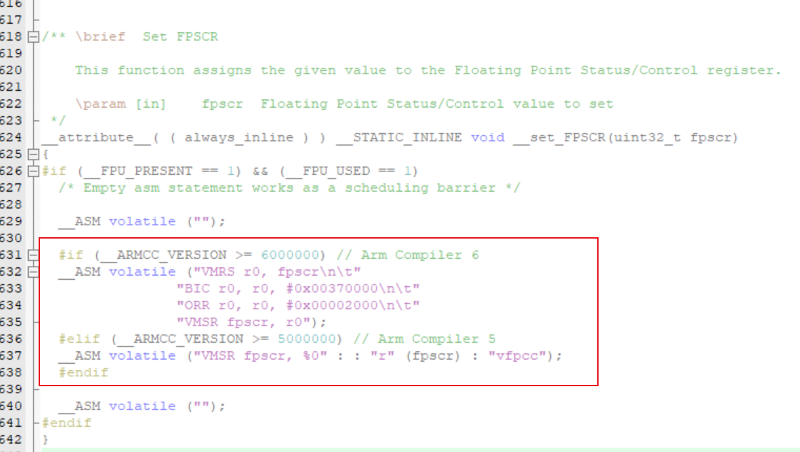

## 复位不初始化变量（不重置变量值）

* 方法 1

分配 RAM 段，勾选 NoInit（注意 at 地址）


* 方法 2

默认即可：


自定义 SCT（注意段名）：


```
LR_IROM1 0x08000000 0x00080000  {    ; load region size_region
  ER_IROM1 0x08000000 0x00080000  {  ; load address = execution address
   *.o (RESET, +First)
   *(InRoot$$Sections)
   .ANY (+RO)
   .ANY (+XO)
  }
  RW_IRAM1 0x20000000 0x0001FF00  {  ; RW data
   .ANY (+RW +ZI)
  }
  RW_IRAM2 0x2001FF00 UNINIT 0x00000100  {
   *(.swrst_keep)
  }
}
```

----

切换为 AC6 时 `__set_FPSCR` 报错，解决方法：



```c
#if (__ARMCC_VERSION >= 6000000) // Arm Compiler 6
__ASM volatile ("VMRS r0, fpscr\n\t"
                "BIC r0, r0, #0x00370000\n\t"
                "ORR r0, r0, #0x00002000\n\t"
                "VMSR fpscr, r0");
#elif (__ARMCC_VERSION >= 5000000) // Arm Compiler 5
__ASM volatile ("VMSR fpscr, %0" : : "r" (fpscr) : "vfpcc");
#endif
```

