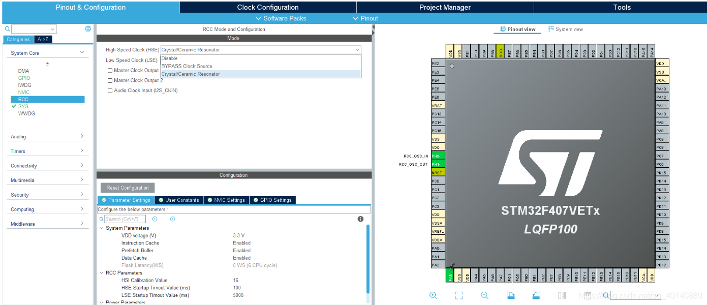
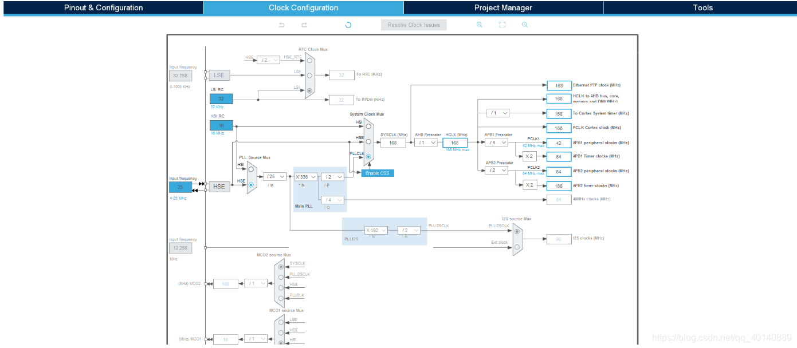
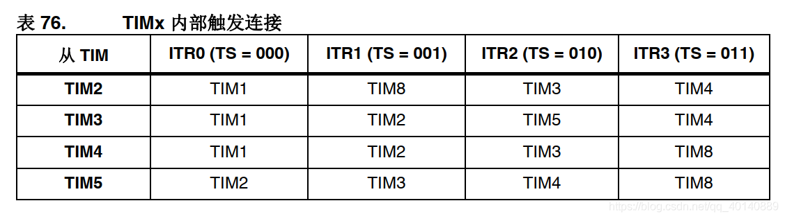
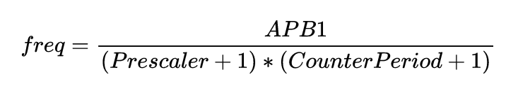
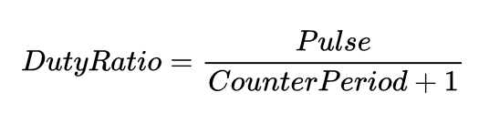
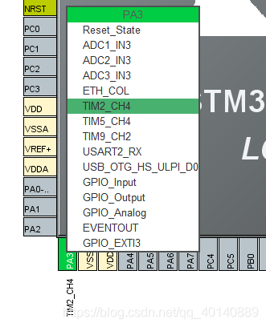
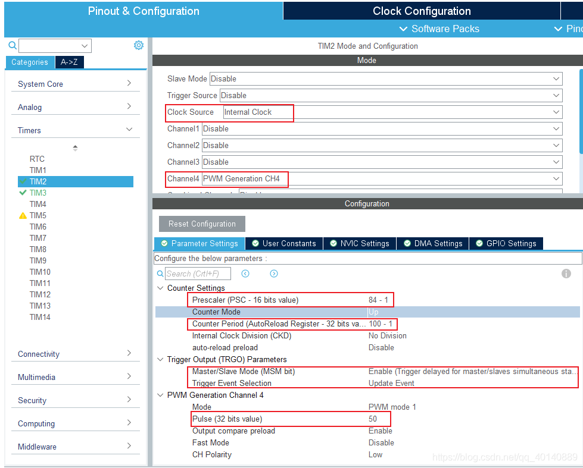
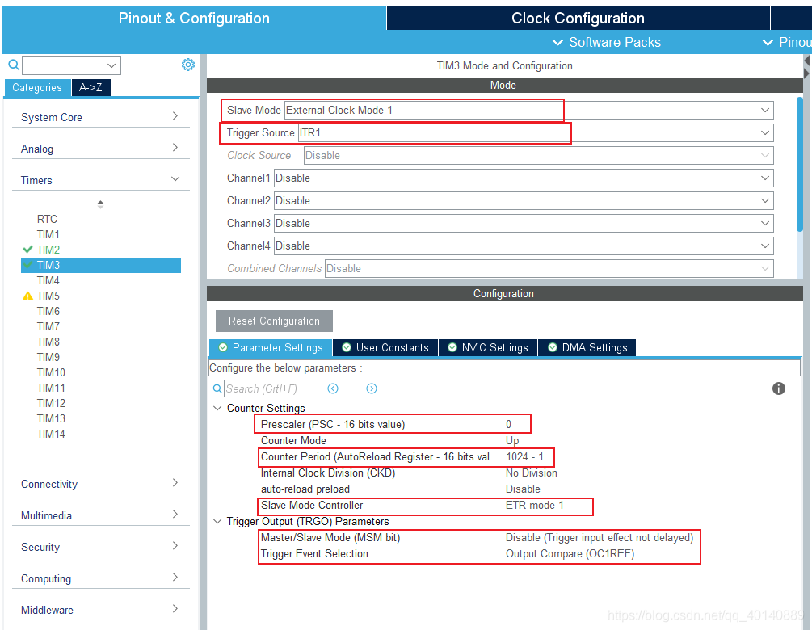
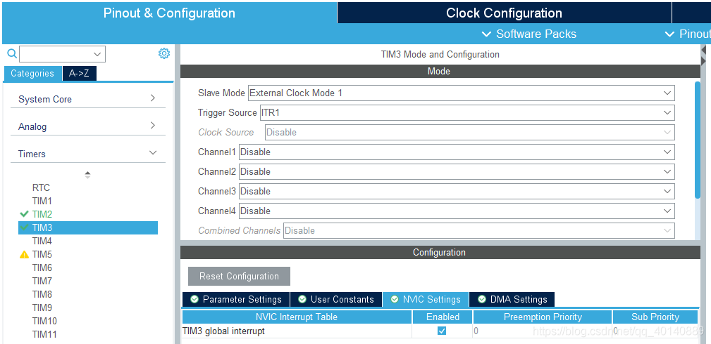

### 功能

主从定时器产生指定个数脉冲。

（推荐使用逻辑分析仪或者示波器的触发模式查看）

### 配置

#### 时钟树

#### 定时器

主定时器用于产生所需要的PWM，从定时器通过主从模式将主定时器产生的PWM作为其输入进行计数，当从定时器达到所设定的数值后触发从定时器的中断，在中断处理中停止主定时器的输出及从定时器的接收，从而达到输出固定数量的PWM脉冲。

本例中采用定时器TIM2作为主定时器，TIM3作为从定时器，PA3输出PWM。根据F4参考手册选择ITR1触发。（仅高级定时器才有）

* 周期计算

* 脉冲输出引脚

* 主定时器

* 从定时器

