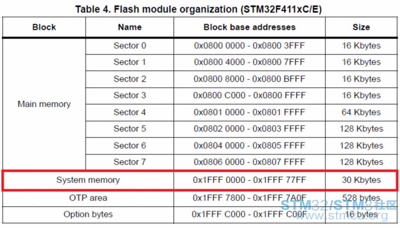
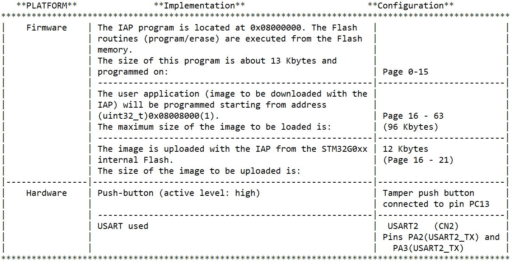
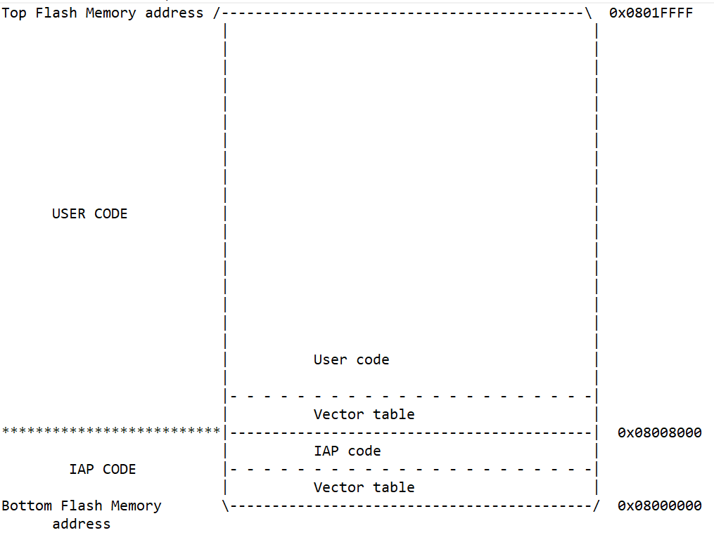
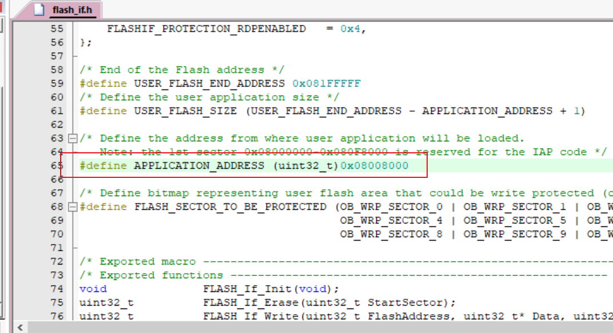
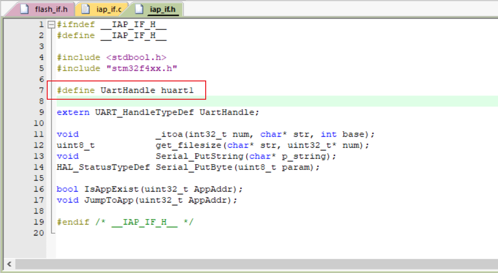
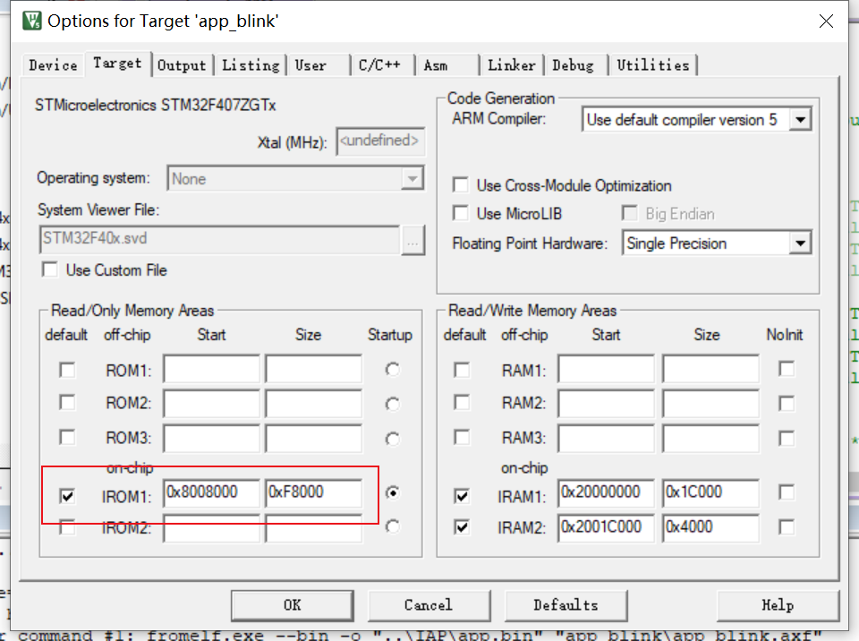
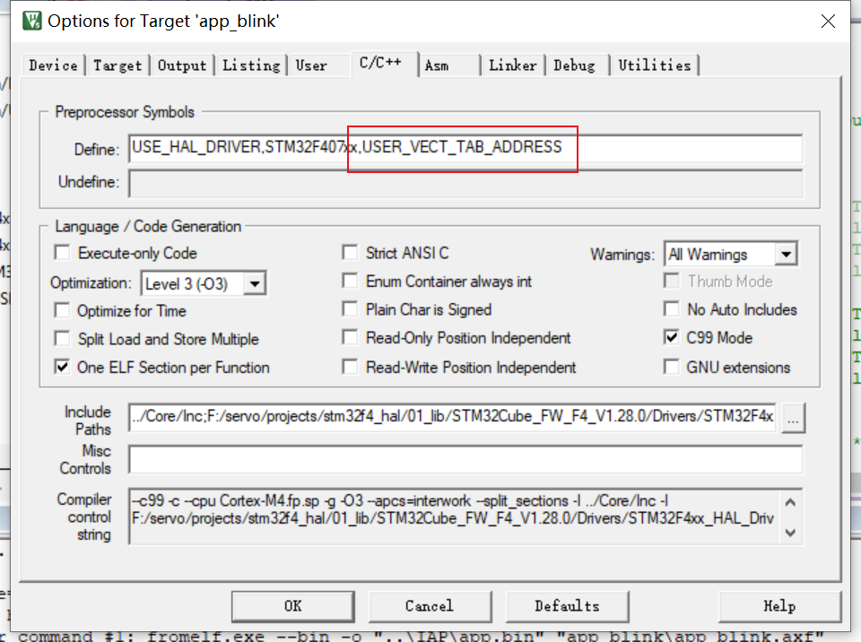
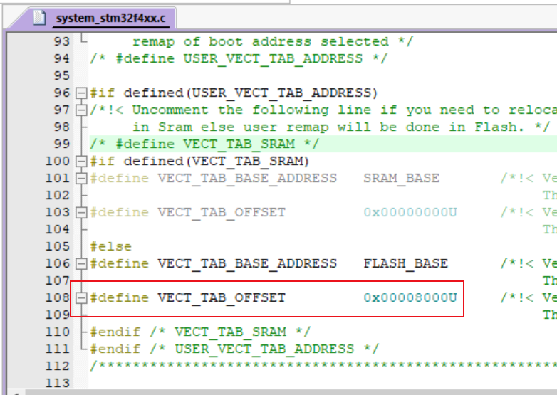

ICP（In-Circuit Programming）：烧录器 SWD

ISP（In System Programing）：芯片出厂是带有的引导程序 Bootloader

IAP（In-Application Programming）： 软件自身实现 Bootloader

# ISP

调用系统存储器中 Bootloader，使用 STM32CubeProgramer 通过 USB/UART 更新程序。

# IAP

## BIOS

1. 用户程序地址

2. 串口设定

## APP

1. 设置固件区域

2. 设置中断向量表偏移

## Xshell

YModem-1K