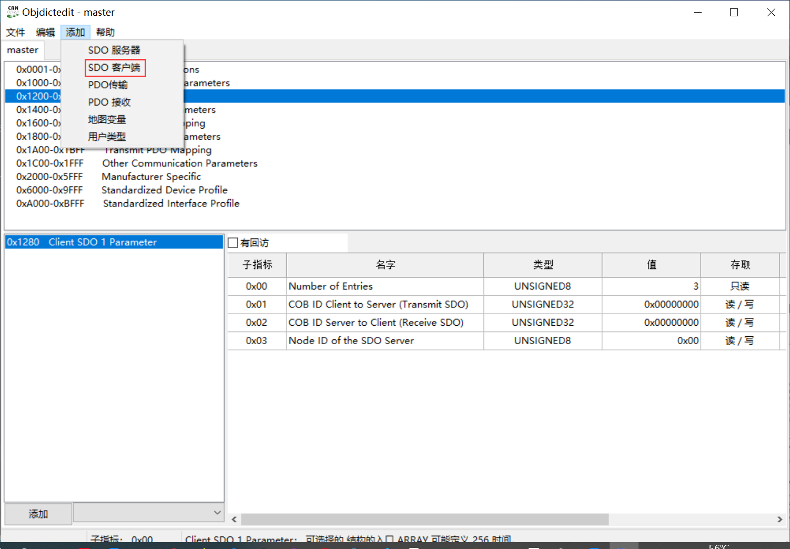
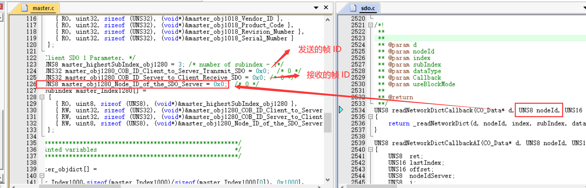

### canopen master slave in one

①

打开对象字典编辑工具 `canfestival\RunObjdictEditor.bat`，添加 `SDO` ，`Ctrl+B` 建立字典（生成 `.h`, `.c` 文件）：

②

主机发送 SDO 时（`writeNetworkDict`/`readNetworkDict`），会根据传入 `nodeId` 匹配对应的 `SDO`。

