[TOC]

# CherryUSB 使用指南[](https://cherryusb.readthedocs.io/zh-cn/latest/#cherryusb)

CherryUSB 是一个小而美的、可移植性高的、用于嵌入式系统的 USB 主从协议栈。同时 CherryUSB 具有以下优点：

**易于学习 USB**

为了方便用户学习 USB 基本知识、枚举、驱动加载、IP 驱动，因此，编写的代码具备以下优点：

- 代码精简，逻辑简单，无复杂 C 语言语法
- 树状化编程，代码层层递进
- Class 驱动和 porting 驱动模板化、精简化
- API 分类清晰（从机：初始化、注册类、命令回调类、数据收发类；主机：初始化、查找类、数据收发类）

**易于使用 USB**

为了方便用户使用 USB 接口，考虑到用户学习过 uart 和 dma，因此，设计的数据收发类接口具备以下优点：

- 等价于使用 uart tx dma/uart rx dma
- 收发长度没有限制，用户不需要关心 USB 分包过程（porting 驱动做分包过程）

**易于发挥 USB 性能**

考虑到 USB 性能问题，尽量达到 USB 硬件理论带宽，因此，设计的数据收发类接口具备以下优点：

- Porting 驱动直接对接寄存器，无抽象层封装
- Memory zero copy
- IP 如果带 DMA 则使用 DMA 模式（DMA 带硬件分包功能）
- 长度无限制，方便对接硬件 DMA 并且发挥 DMA 的优势
- 分包功能在中断中处理

**从机协议栈整体执行流程**

### **主机协议栈整体执行流程**

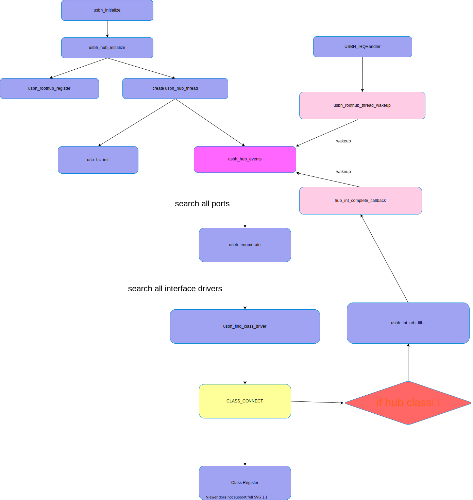

# USB 基本概念(2.0)

## 简介

 USB 的接口和速度根据不同的 USB 版本的分类，如图所示：

其次是 USB 需要满足的电平标准，有了电平标准后，下面说的信号状态就可以进行分类了。USB2.0 和 USB3.0 支持的电压范围和最大电流如下：

## USB 信号状态

首先我们需要了解的是 USB 的电气特性中的 Signaling Level，也就是信号状态。USB 主要是靠 D+ 和 D- 来实现不同的信号状态，然后进行通信。官方手册 7.1.7 中列举出了低速、全速和高速时的信号状态对应的 D+ 和 D- 需要满足的要求。

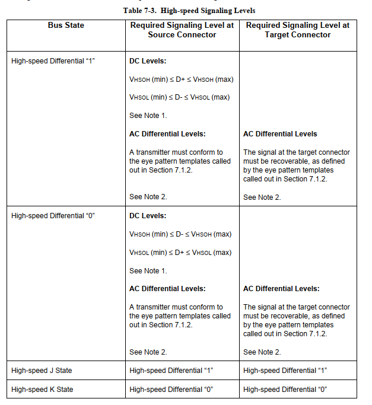

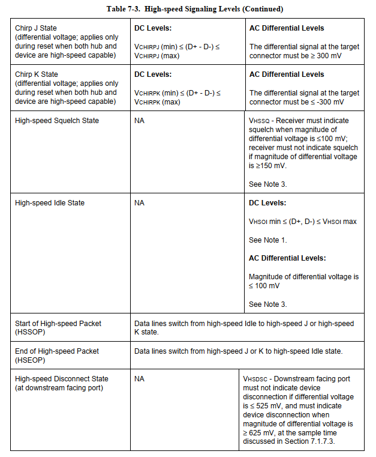

- **差分 0 和差分 1**： 这两个状态用于通过 USB 进行的通用数据通信。当 D+线为高电平、 D-线为低电平时，该状态为差分 1。当 D+线为低电平、 D-线为高电平时，该状态为差分 0。
- **J 状态和 K 状态**： 除了差分信号外， USB 规范还定义了其他两个差分状态： J 状态和 K 状态。它们的定义由设备速度决定。在全速和高速设备上， J 状态为差分 1 而 K 状态是差分 0。在低速设备上，该情况则相反。
- **单端 0（ SE0）**： 在 D+和 D-均为低电平时所发生的状态。该状态表示一个复位、断连或数据包的结束。
- **单端 1（ SE1）**： 在 D+和 D-均为高电平时发生的状态。不会故意生成该状态，并且不能在 USB 设计中出现。
- **闲置**： 必须在发送一个数据包的前后发生的状态。如果一个数据线为低电平，而另一个数据线为高电平，则表示闲置状态。高电平和低电平的定义由设备的速度决定。在全速设备上，闲置状态是指 D+为高电平、 D-为低电平。在低速设备上，该情况则相反。
- **恢复**： 用于使设备从挂起状态唤醒。通过发送一个 K 状态实现该操作。
- **数据包的开始（ SOP）**： 当 D+和 D-线从闲置状态转换到 K 状态时，将在开始低速或全速数据包前发生。
- **数据包的结束（ EOP）**： 在低速或全速数据包结束时发生。当 SE0 状态持续两位时间（后面的内容将介绍位时间）以及 J 状态持续 1 位时间时，将发生 EOP。
- **复位**： 在 SE0 状态持续 10 ms 时发生。在 SE0 至少持续 2.5 ms 后，该设备会复位，并开始进入复位状态。
- **保持活动（ Keep Alive）**： 在低速设备中使用的信号。低速设备缺少了一个帧起始数据包（用于防止挂起状态）。每次经过 1 ms，它们都会使用一个 EOP 来防止设备进入挂起状态。

下面我们通过一个波形，来区分这些信号状态：

- 第一个红框，可以看出是一个数据包的开始，并且假设这是一个全速设备，那么D+ 为高，D- 为低，是一个闲置状态。
- 第二个红框，D+为低，D- 为高，说明是一个 K 状态，由 闲置转 K 状态说明他是一个 SOP。
- 第三个红框开始表示数据，表示 JKJKJKJKJK。
- 第四个红框表示 SE0 ,因为D+和 D-均为低电平。
- 第五个红框，而 SE0 持续了一段时间后，变成了 D+高，D- 低，说明他是一个 J 状态，从 SE0 切换成 J 状态，说明他是一个 EOP。

## USB 速度识别

USB 的速度是如何判定的？ 这个见手册 7.1.5.1。USB 的速度检测主要是靠 D+ 和 D-线上拉 1.5K决定，如果 D+上拉1.5k，则该设备为全速设备，如果 D-上拉1.5k，则为低速设备。而高速设备初始是以一个全速设备的身份出现，和全速设备一样，D+线上有一个1.5k的上拉电阻。USB2.0的hub把它当作一个全速设备，之后，hub 和设备通过一系列握手信号确认双方的身份，最终判定该设备为高速设备。

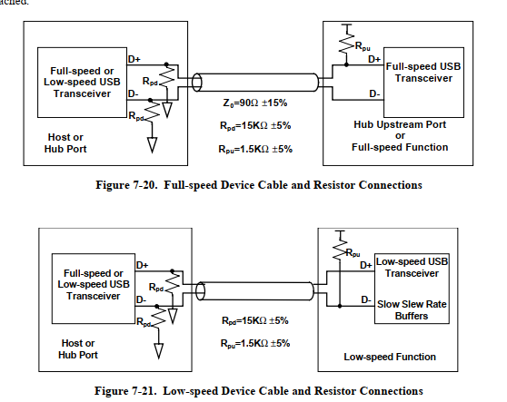

## USB 连接与断开检测

那么 当我们的设备插上 USB 主机时，主机是如何知道有设备插入或者拔出呢？手册 7.1.7.3 给出了答案，如图所示：

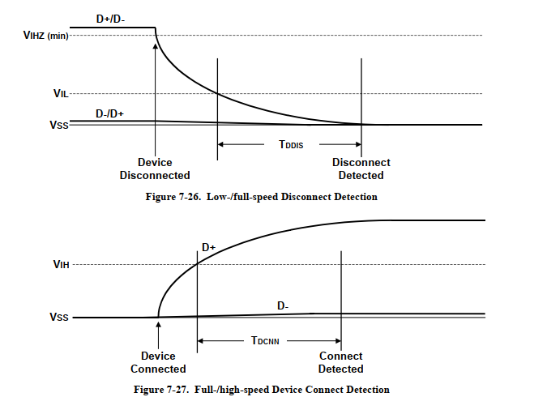

首先是连接检测，主机检测到某一个数据线电平拉高保持了一段时间，就认为有设备连接上来了。低速设备连接时，主机会检测到D-线被拉高，全速/高速设备连接时，主机会检测到D+线被拉高。 而断开检测，则是主机端D+、D-数据线上的下拉电阻起作用，断开后使得二者都在低电平；当低电平持续 TDDIS 时间就会被主机认为是断开状态。上图中，TDDIS在2到2.5us之间。

## USB 电源

作为 USB 电源时， USB 设备可被划分为两种设备类型：总线供电和自供电。

- 总线供电是 USB 设计的一个优势。由于设备通过总线供电，因此不需要使用笨重的内部或外部电源，它仍能够维持自身操作。总线可由主机或集线器供电。使用某个总线供电的设备时，用户将设备配置为某种状态前必须考虑其功耗。
- 自供电设备通过使用外部电源（如直流电源适配器或电池）为自己供电。自供电设备在进行设计的过程中需要考虑到一些注意事项。 USB 规范要求自供电设备一直监控自己的 VBUS 线。 VBUS 不存在的时间内，设备必须断开提供给 D+/D-线上的上拉电阻的电源，从而防止向主机或集线器供电。 否则，会导致 USB 合规性测试发生失败。但是自供电集线器能够从总线获得最多 100 mA 的电流。

## USB 设备状态

在 USB 插上主机的那一刻， USB 设备本身的设备状态是会变化的。而这个设备状态，后面如果学习到枚举过程，可以知道，其实这段变化描述的就是枚举过程。这部分见手册 9.1.1。

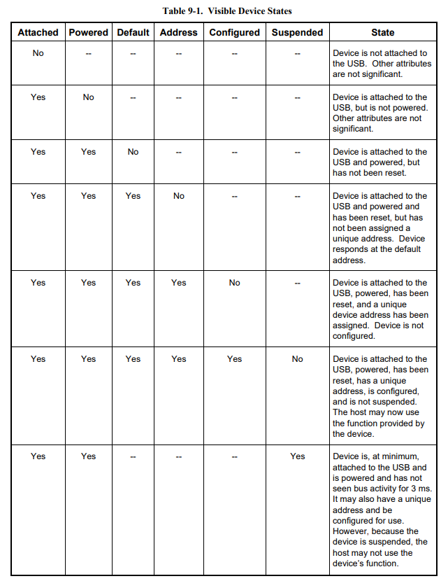

- 连接状态： 当将某个设备插入到主机/集线器，但主机/集线器不给 VBUS 线供电时，会出现这种状态。它通常在集线器检测到一个过流事件时出现。虽然仍连接着设备，但主机移除了供给它的电源。
- 供电： 某个设备被连接到 USB 上并得到供电，但仍未接收到一个复位请求。
- 默认： 某个设备被连接到 USB 上、得到供电，并且由主机进行了复位。这时，设备没有任何设备地址。 设备会响应地址 0。
- 地址： 某个设备被连接到 USB、得到供电、被复位，并且有一个唯一的地址。但是设备仍未得到配置。
- 配置： 设备已经连接到 USB、得到供电、被复位、具有唯一的地址、得到配置，但尚未进入挂起状态。此时，总线供电设备能够消耗超过 100 mA 的电流。
- 挂起： 如上面所述，设备已经建立好了连接，并且得到配置，但在 3 ms 时间内不会进行任意总线操作。

翻译成中文图就是：

## USB 编码与位填充

首先，USB 的数据是串行发送的，就像 UART、I2C、SPI 等等，连续的01 信号只通过一根数据线发送给接受者。但是因为发送者和接收者运行的频率不一样，信号的同步就是个问题，比如，接受者接收到了一个持续一段时间的低电平，无法得知这究竟是代表了 5 个 0 还是 1000 个 0。一个解决办法，就是在传输数据信号的同时，附加一个时钟信号，用来同步两端的传输，接受者在时钟信号的辅助下对数据信号采样，就可以正确解析出发送的数据了，比如 I2C 就是这样做的，SDA 来传输数据，SCL 来传输同步时钟：

虽然这样解决了问题，但是却需要附加一根时钟信号线来传输时钟。因为USB没有时钟信号，有没有不需要附加的时钟信号，也能保持两端的同步呢？ 有的，这就是 RZ 编码（Return-to-zero Code），也叫做归零编码。

### RZ 编码（Return-to-zero Code）

RZ 编码（Return-to-zero Code），也叫做归零编码。在 RZ 编码中，正电平代表逻辑 1，负电平代表逻辑 0，并且，每传输完一位数据，信号返回到零电平，也就是说，信号线上会出现 3 种电平：正电平、负电平、零电平。

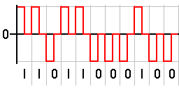

从图上就可以看出来，因为每位传输之后都要归零，所以接受者只要在信号归零后采样即可，这样就不在需要单独的时钟信号。实际上， RZ 编码就是相当于把时钟信号用归零编码在了数据之内。这样的信号也叫做自同步（self-clocking）信号。 这样虽然省了时钟数据线，但是还是有缺点的，因为在 RZ 编码中，大部分的数据带宽，都用来传输“归零”而浪费掉了。

### NRZ 编码（Non-return-to-zero Code）

去掉这个归零步骤，NRZ 编码（Non-return-to-zero Code）就出现了，和 RZ 的区别就是 NRZ 是不需要归零的。

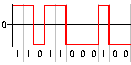

### NRZI 编码（Non-Return-to-Zero Inverted Code）

NRZI 编码（Non-Return-to-Zero Inverted Code）和 NRZ 的区别就是 NRZI 用信号的翻转代表一个逻辑，信号保持不变代表另外一个逻辑。这个见手册 7.1.8。

如图所示，可以得出一个简单的记忆方式：遇到 0 的边沿电平就翻转，遇到 1 的边沿则不变。

### 位填充（bit-stuffing）

但是，这样还是会有一个问题，就是虽然接受者可以主动和发送者的频率匹配，但是两者之间总会有误差。假如数据信号是 1000 个逻辑 1，经过 USB 的 NRZI 编码之后，就是很长一段没有变化的电平，在这种情况下，即使接受者的频率和发送者相差千分之一，就会造成把数据采样成 1001 个或者 999 个 1了。 USB 对这个问题的解决办法，就是强制插 0，也就是（位填充）bit-stuffing，如果要传输的数据中有 6个连续的 1，发送前就会在第 6 个 1 后面强制插入一个 0，让发送的信号强制出现翻转，从而强制接受者进行频率调整。 接受者只要删除 6 个连续 1 之后的 0，就可以恢复原始的数据了。这部分见手册 7.1.9。

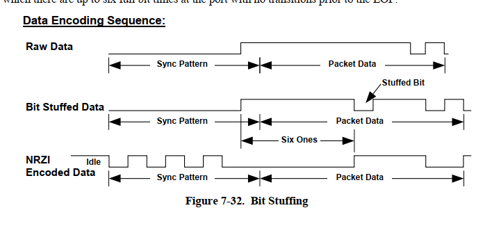

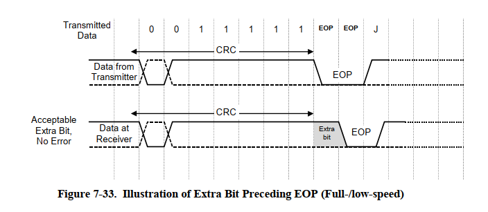

在数据被NRZI编码之前，在数据流中每六个连续的1之后插入一个0，以强制NRZI数据流中的过渡，这使接收器逻辑至少每七位有一次数据转换，以保证数据和时钟的锁定。比特填充是从同步模式开始启用。结束同步模式的数据 "一 "被算作是序列中的第一个 "一"。序列中的第一个。除了高速EOP期间，发射器的位填充总是被强制执行。如果需要按照 位填充规则的要求，零位将被插入，即使它是数据包结束（EOP）信号前的最后一位。接收器必须对NRZI数据进行解码，识别填充位，并将其丢弃。

## USB 字段(域)

USB 字段构成了 USB 通信中最基本也是最小的单元，后面的包、事务，最根本都是由字段构成，而字段又是由比特构成。字段部分见手册 8.1。

备注

USB 的比特先行模式是按照 LSB 先行原则。

### 同步字段

在 USB 系统中，主机和设备不是共享一个时钟，这使得接收方没办法准确知道发送方什么时候发送数据，尽管能检测到SOP，但是远远不够，所有这个时候就需要同步字段，使得接收方和发送方收发过程中保持同步，所以任何一个包都要以同步字段开始。同步字段0x01，经过编码以后就是01010100B。

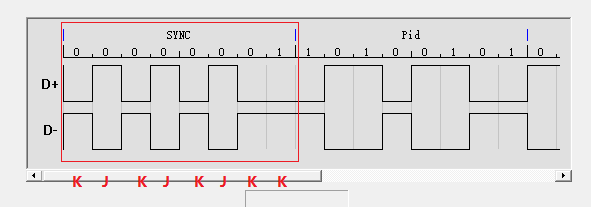

### 包标识符字段

PID 由一个四位数据包类型字段和一个四位校验字段组成，占用 8 个bit，如图所示。 PID指示数据包的类型，并通过推断，数据包的格式和应用于数据包的错误检测类型包。 PID的四位校验字段是通过执行分组类型字段的一个补码来生成，从而确保PID的可靠解码，以便正确解释分组的其余部分，如果四个PID校验位不是它们各自的分组标识符位的补码，则存在PID错误。

既然是 4个比特，说明了 PID 类型可以分为16种，从16种中，又细分成4类：令牌 PID,数据 PID，握手 PID 和特殊 PID。

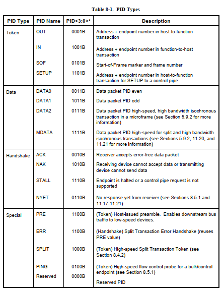

### 地址字段

地址字段又分为设备地址字段和端点地址字段，其中设备地址字段占用 7 个bit，除去0 地址，主机可以分配的地址有 127个。

端点地址字段占用 4个 bit，总共可以提供 16 个端点。

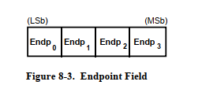

### 帧号字段

帧号字段占用 11 个bit，主机每发出一个帧，帧号都会加1，如图所示。而高速设备中，帧中又包含微帧，1帧=8微帧，微帧则是加0.1。关于帧和微帧的概念，后续补充。

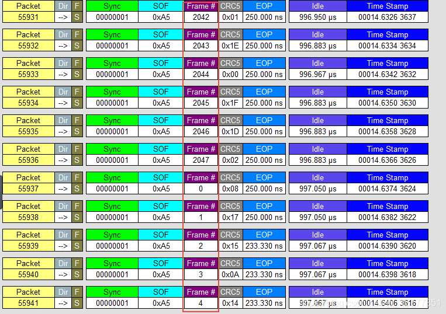

### 数据字段

根据传输类型不同，数据字段中的数据长度也是不定的，从 0-1024不等。

### CRC 字段[](https://cherryusb.readthedocs.io/zh-cn/latest/usb/usb2.0_basic.html#crc)

循环冗余校验（CRC）用于保护令牌和数据包中的所有非PID字段。PID不包含在包含CRC的分组的CRC校验中。 在执行比特填充之前，在发送器中的各个字段上生成所有CRC。 类似地，在去除填充位之后，在接收器中对CRC进行解码。令牌和数据包CRC为所有单比特和双比特错误提供100％的覆盖。 CRC失败被认为表示一个或多个受保护字段已损坏并导致接收器忽略这些字段，并且在大多数情况下，忽略整个数据包。

- 令牌CRC

为令牌提供五位CRC字段，并覆盖IN，SETUP和OUT令牌的ADDR和ENDP字段或SOF令牌的时间戳字段。 PING和SPLIT特殊令牌还包括一个五位CRC字段。

生成多项式为： G（X）= X^5 + X^2 + 1 表示该多项式的二进制位模式是00101B。 如果接收到所有令牌位而没有错误，则接收器处的五位校验和将为01100B。

- 数据CRC

数据CRC是应用于数据分组的数据字段的16位多项式。

生成多项式是：G（X）= X^16 + X^15 + X^2 + 1 表示该多项式的二进制位模式是1000000000000101B。 如果没有错误地接收到所有数据和CRC位，则16位校验和将为1000000000001101B。

## USB 包

包由字段组成，根据 PID 类型，包分为四大类：令牌包、数据包、握手包、特殊包。此节内容见官方 8.4.1。

算上 SOP,则如图，组成一个完整的包。

### 令牌包

令牌包分为：SETUP、IN、OUT、SOF，其中 SETUP、IN、OUT的字段组成一样，如图：

- PID 字段：定义了数据传输方向为USB主机到USB设备。
- ADDR 字段：指明了USB设备地址。
- ENDP 字段：指明了接收数据的端点号。
- CRC 字段：用于ADDR字段和ENDP字段进行循环冗余校验。

SOF 包的字段组成，如图：

- PID 字段：定义了数据传输方向为USB主机到USB设备。
- 帧号 字段：指明了USB传输的帧号，其11位。
- CRC 字段：用于ADDR字段和ENDP字段进行循环冗余校验。

### 数据包

- PID 字段：用于指明不同的数据包类型。支持 4 种数据包，分别为： DATAO 、 DATA1 、DATA2 和MDATA。
- 数据 字段：其中包含了传输的数据。其数据的大小根据数据传输类吧和川户需要而定。根据 USB 协议的规定，对于低速 USB 数据传输， 最大长度为8字节对于全速SB 数据传输，其最大长度为 1023 字节；对于高速 USB 数据传输，数据最大长度为 1024 。
- CRC 字段：这里使用 16 位的循环冗余校验来对数据字段进行保护。

### 握手包

握手包由8位的PID构成，用于数据传输的末位报告本次数据传输的状成。握手包之后使是整个事务处理的结束信号EOP.

### 特殊包

## USB 事务

USB 常用事务共有三种：SETUP、IN、OUT，除了控制传输使用三个事务，其他传输都使用两个事务。特殊事务则是不携带数据的事务。

### SETUP 事务

### IN 事务

### OUT 事务

### 特殊事务

## USB 传输

### 控制传输

### 批量传输

### 中断传输

### 同步传输