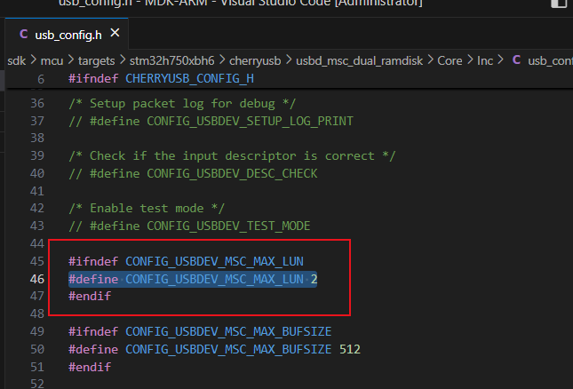

[TOC]

# 大容量储存设备

## 双盘符

1. 调整逻辑单元数量

lun：logical unit number，逻辑单元号



2. 实现接口

```c
void usbd_msc_get_cap(uint8_t busid, uint8_t lun, uint32_t* block_num, uint32_t* block_size)
int usbd_msc_sector_read(uint8_t busid, uint8_t lun, uint32_t sector, uint8_t* buffer, uint32_t length)
int usbd_msc_sector_write(uint8_t busid, uint8_t lun, uint32_t sector, uint8_t* buffer, uint32_t length)
```

