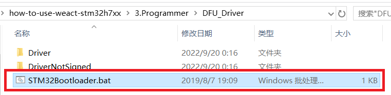
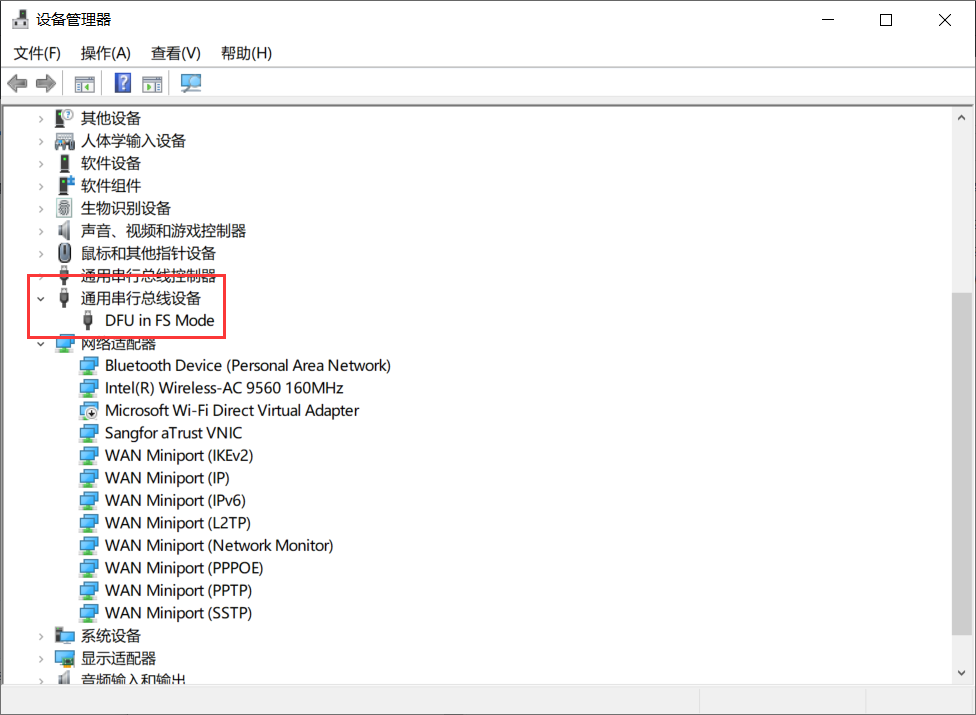
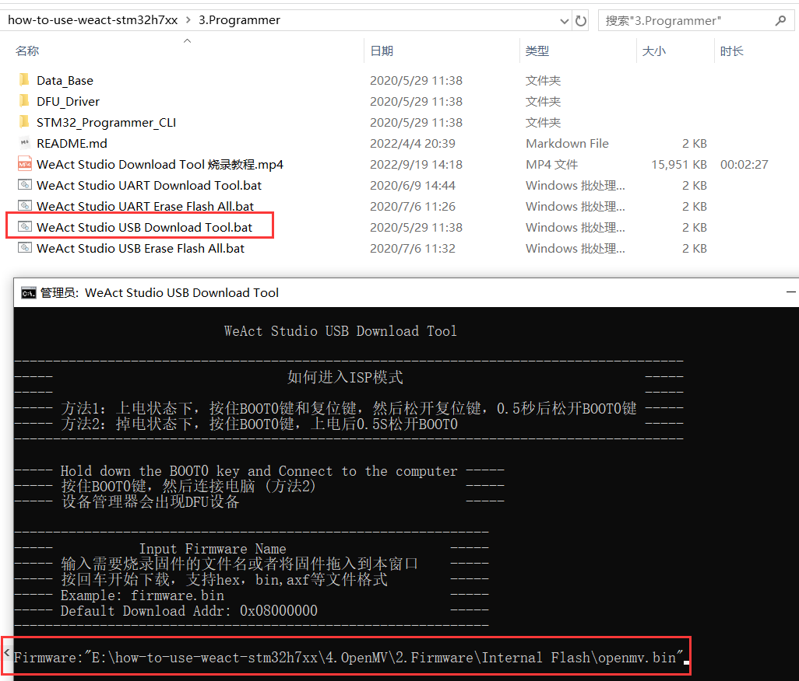

## 教程

https://book.openmv.cc/

https://singtown.com/openmv/

https://singtown.com/learn/

https://github.com/openmv/

https://github.com/SingTown/openmv

## IDE

OpenMV-IDE-windows-v2.6：https://www.aliyundrive.com/s/DRWY5asGhhy

## 固件烧录

STM32H743VIT6 烧录 OpenMV 记录：

* 安装DFU

* 按着BOOT键插入数据线

* 打开烧录工具，拖入`Internal Flash`中的`OpenMV`固件，按回车键即可

* 编写代码 