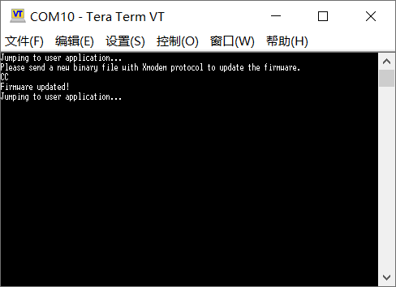
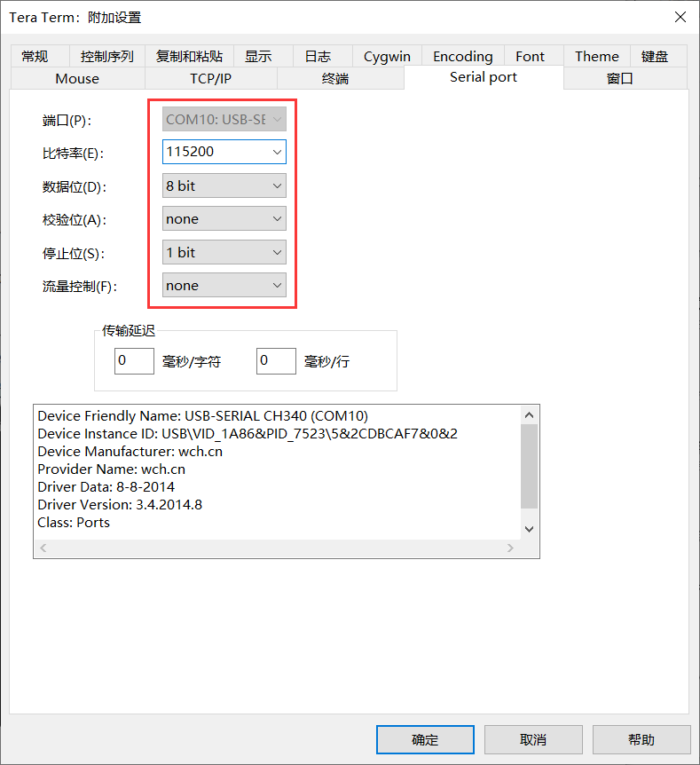

## Enter Bootloader

按下 PA0，按下 PST，松开 RST，松开 PA0

Configure them in the following way:

- Baud rate: 115200
- Data bits: 8
- Parity: none
- Stop bits: 1

In ExtraPuTTYtel:  select *Files Transfer* >> *Xmodem* (or *Xmodem 1K*) >> *Send* and then open the binary file.

In Tera Term: select *File* >> *Transfer* >> *Xmodem* >> *Send* and then open the binary file.

