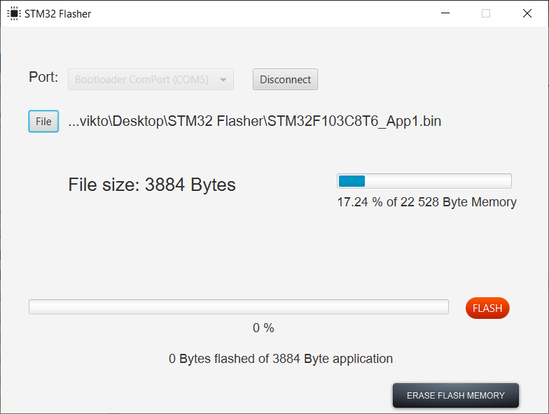

### 前置条件

https://gluonhq.com/products/javafx/
https://www.oracle.com/java/technologies/downloads/#jdk24-windows

按住 jdk-24_windows-x64_bin.exe

解压 openjfx-21.0.7_windows-x64_bin-sdk.zip

替换 run.cmd 中 avafx-sdk-21.0.7/lib 所在路径

### 运行程序

#### 进入 bootloader

按住 PA0，按下 RST，松开 RST，松开 PA0。

双击 run.cmd 运行，连接 stm32 虚拟出来的串口。

选择固件，擦除内存区域，烧录。

#### 进入 application

松开 PA0，按下 RST，松开 RST。

若用户区域无程序，PC13 上的 LED 会频繁快速闪烁。