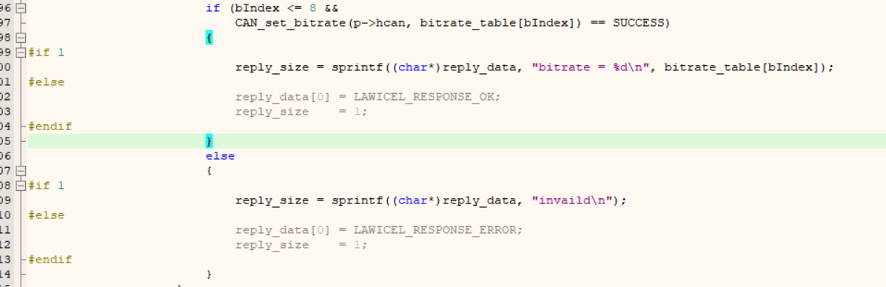

# uart to can
USB (UART) to CAN bus tranciesver ([LAWICEL Protocol](http://www.can232.com/docs/can232_v3.pdf)) 

### Realized protocol commands:
- 't'	: send CAN frames

```
t11120101: id(hex) = 111, DLC = 2, Data(hex) = 01 01
```

- 'Sx'	: set bitrate

```
S6: bit rate = 500 kbit
```

- 'Zx'	: enable|disable timestamp in monitoring packets
- 'O'	: open channel

```
O: open channel
```

- 'C'	: close channel
- 'V', 'v': hardware and software version


注意，本项目时以 '\n' 结尾的，不是以 '\r' 结尾的，调试时请注意！！

默认波特率 115200.

且部分指令响应调整过，如：




