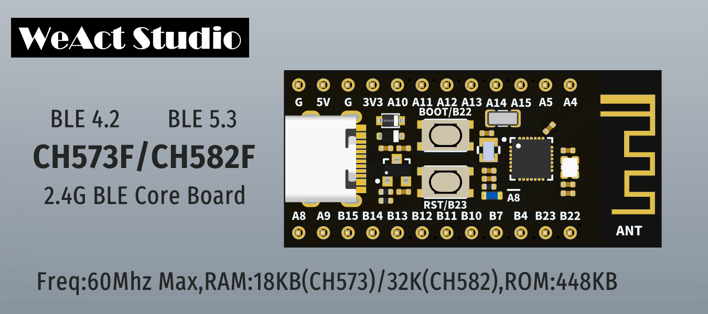

# WCH-BLE

WCH Official Website [zh-CN](www.wch.cn) / [en](www.wch-ic.com)

| Dir Name |                    Explain                    |
| :------: | :-------------------------------------------: |
|  CH573F  | 60Mhz Max,18KB RAM,448KB ROM,RISC-V3A,BLE 4.2 |
|  CH582F  | 60Mhz Max,32KB RAM,448KB ROM,RISC-V4A,BLE 5.3 |
|  CH592F  | 60Mhz Max,32KB RAM,448KB ROM,RISC-V4C,BLE 5.4 |

## BSP

**clock**：

* 32Mhz HSE 
* 32.768k LSE

**power**：

* 3.3V LDO Max 100mA

**key**：

* Reset：B23 
* Boot：B22   