# 在工程中单独设置预编译宏

为了减小EVT大小，沁恒官方整合了一些文件作为公共文件，由多个工程共同使用。比如说调试BLE例程和蓝牙mesh例程时，有config.h这个文件，直接在该文件中修改宏，会影响到很多工程。可以在右键工程名->中设置宏定义，只针对这一个工程配置宏。比如说我在某工程中加一个HAL_SLEEP宏置1，见下图。

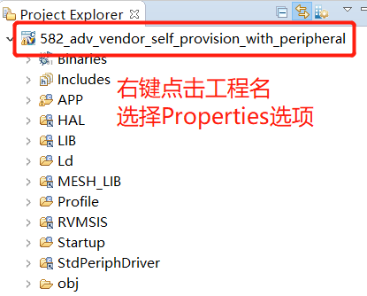

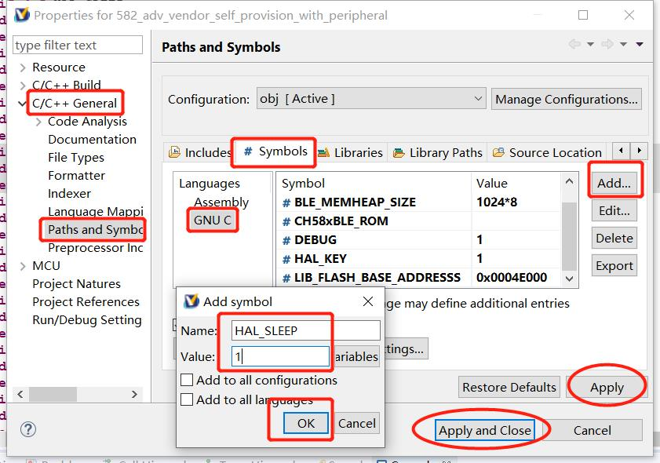

配置好之后，该工程config头文件中的HAL_SLEEP宏会变成灰色，表示此处的宏不生效，以工程配置中的编译预处理为准。

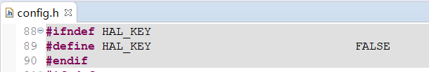

# 将变量存放到指定RAM地址

若要指定变量在某个RAM地址，需要在同①的右键工程名->Properties配置中添加一行代码，在Linker flags中加入**--section-start=.XXX=RAM中****的起始地址**，XXX为地址名，如下图。在582芯片中，这个值要大一点，前面部分RAM在其他特定的地方有用到，当然也不能超过582RAM的最大值32K。笔者这里用0x20001000，编译后是可以运行的。RAM的基地址为0x20000000。

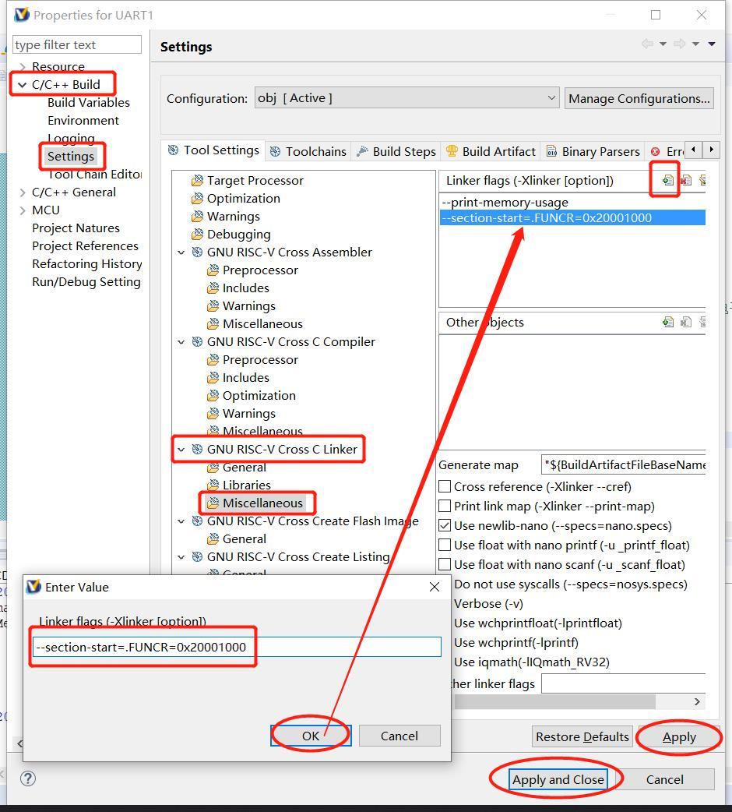

在定义变量时使用__attribute__((section(".XXX")))修饰一下，如下图。即使此处赋了初始值，实际分配的值仍是随机值，需要在程序中再赋一下值。此值在RAM保持，不会受到按键复位的影响，但断电丢失。

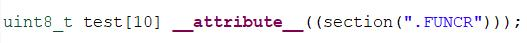

编译之后可以在工程的obj文件夹下的.map文件中找到地址映射的位置，如下图。

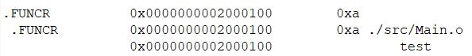

# 串口打印浮点数

沁恒目前的57x、58x系列蓝牙芯片，均不支持硬件浮点运算，不过默认是支持硬件整型程序和软件浮点运算的。软件浮点运算可以直接计算和使用，只是默认设置直接printf打印，是打印不出来的。若要打印浮点数，需要在右键工程名->Properties配置，在下图位置，勾选一下打印库的选项，二选一。使用的库相比之前多了，根据选择的库不同，会占用相应的更多的flash和ram。勾选后点击Apply应用以及Apply and Close应用并关闭，确保配置成功保存。**注意这两个库不要与wchprintf一起勾选，可能会无法打印。如果既要能打印浮点数，又要能不加\n换行，勾选一个wchprintfloat即可。**

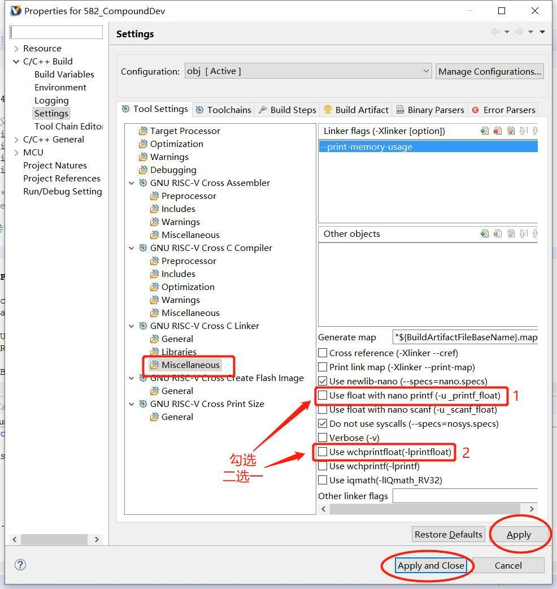

 框选前↓

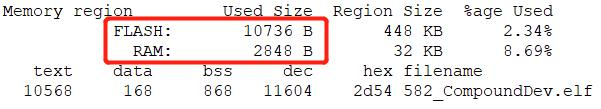

1框选后↓

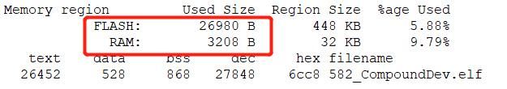

2框选后↓

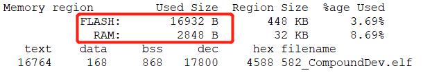

 还有一种方法，按②中的操作，去掉勾选，使用完整库，也能打印浮点型，但是库大了很多，不推荐。②例中库增量比较小是由于②中没有涉及到float类型的运算。

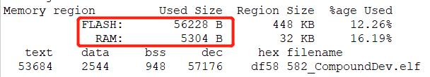

**四、**添加64位数据处理

582默认使用32位运算，若想使用64位运算，可以在右键工程名->Properties配置中，去掉下图中的勾选来实现。从nano库改为完整大小的库，使用的库变大而占用更多的flash和ram。

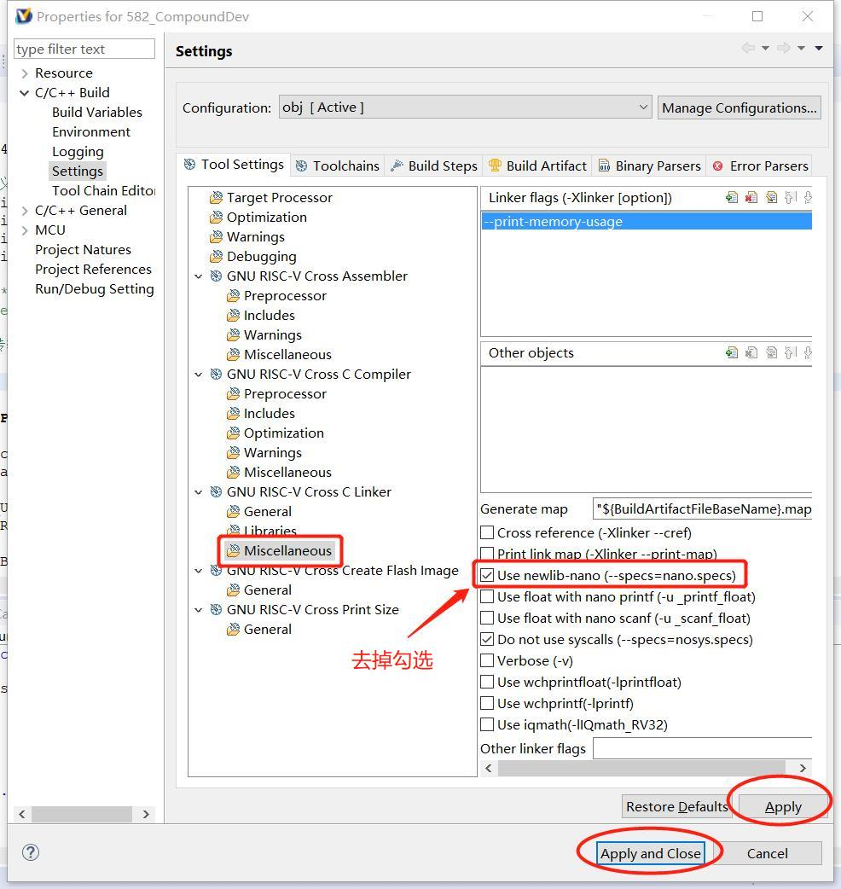

去掉框选前↓

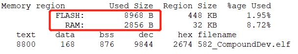

去掉框选后↓

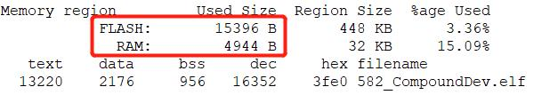

# 使用math数学库

若要使用数学公式，在包含了math.h之后，还需要增加下math库。右键工程名->Properties配置，在下图Libraries中，添加math库的简写m即可。

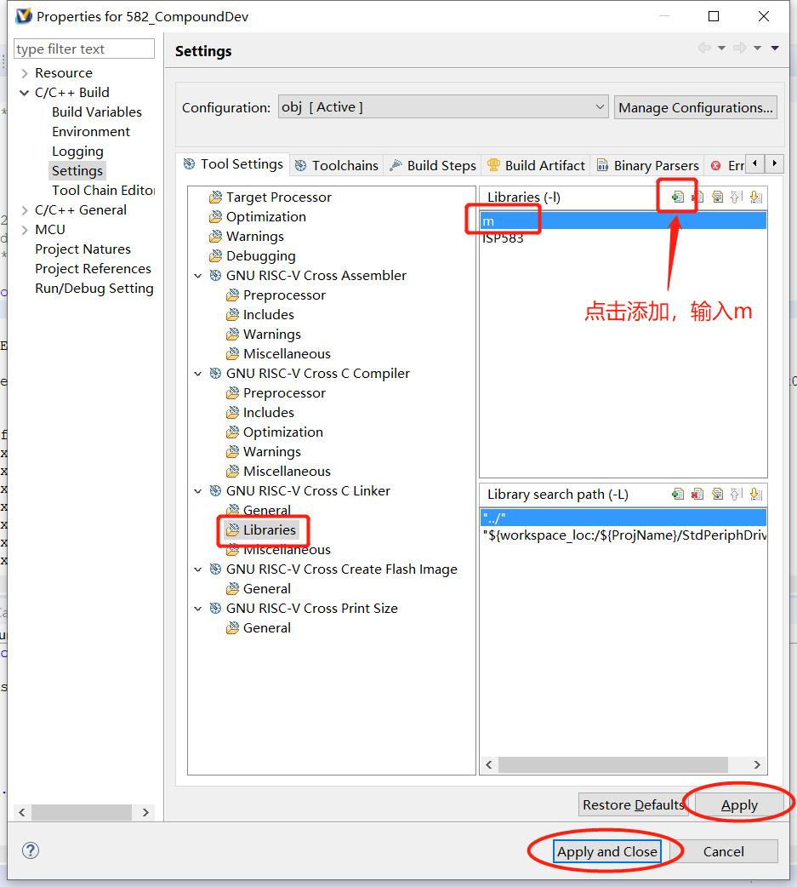

# 关闭仿真时自动清dataflash功能

使用WCH-LINK仿真时，默认是清空所有flash的，需要在debug configurations中针对仿真的工程添加一行配置，在运行仿真时不会自动清空flash。

-c page_erase

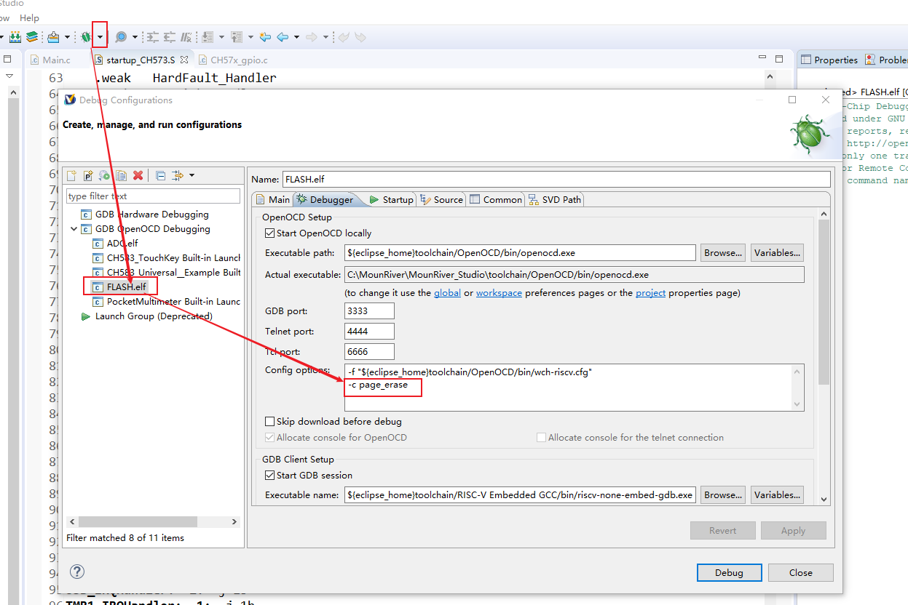

 

# 配置printf待打印数据不加\n换行

默认情况配置下使用printf函数，需要在待打印的字符串后加\n换行，串口助手中才会显示全部数据，否则将会缓存一块数据，满了再全部输出打印。可以在右键工程名->Properties配置中，勾选下方的库，这样可以不用换行符，直接打印数据。**注意\**wchprintf\**不要与(三)中的\**两个库\**一起勾选，可能会无法打印。如果既要能打印浮点数，又要能不加\n换行，勾选一个wchprintfloat即可。**

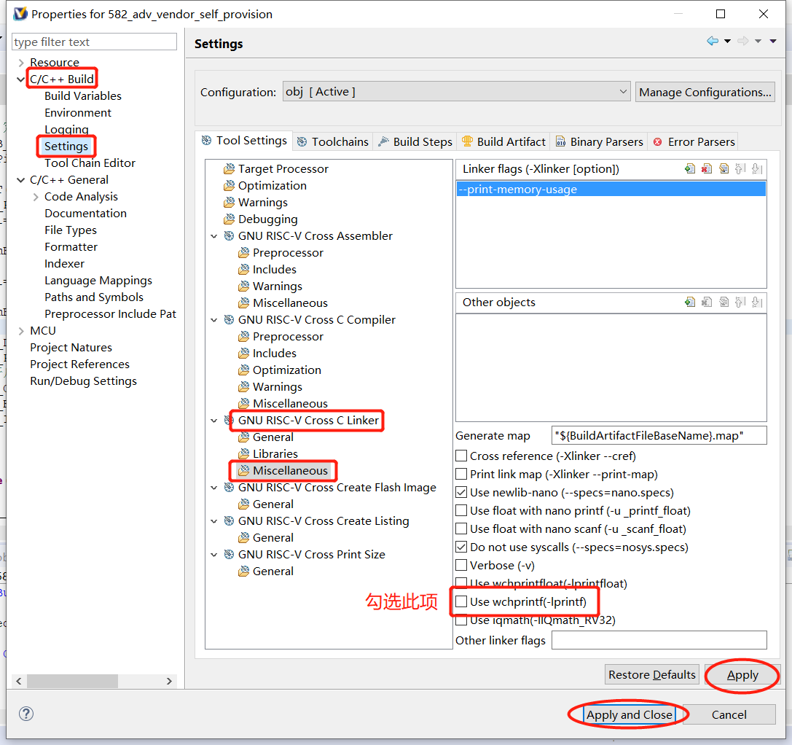

 

# 修改编译器输出hex文件的位置

如题

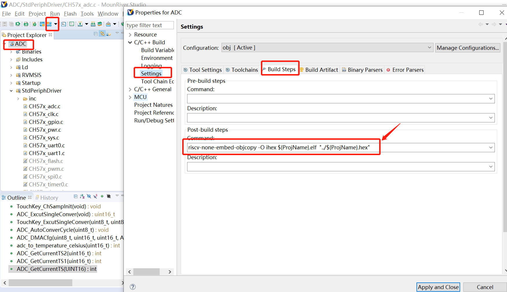

 

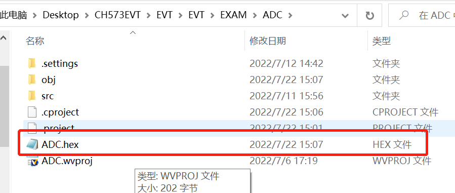

 

**指令：riscv-none-embed-objcopy -O ihex ${ProjName}.elf "相对于obj的相对路径/${ProjName}.hex"**

 

# 编译器生成bin文件

MRS编译默认生成hex文件，如果想直接生成BIN文件可以按照如下设置

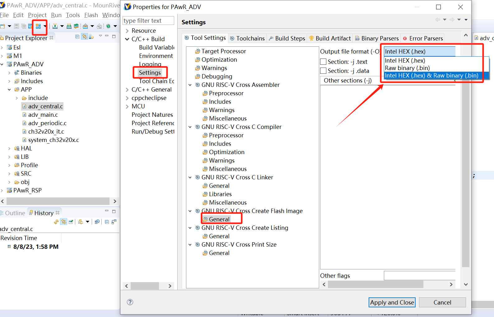

效果截图

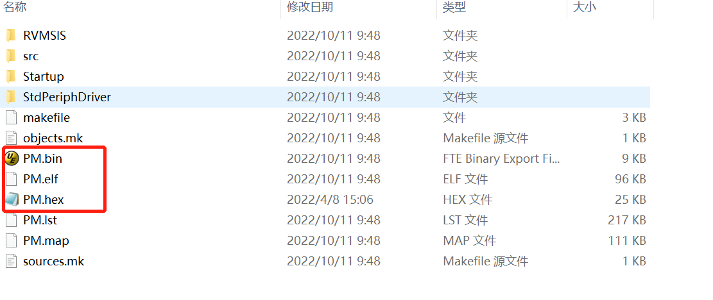

# const修饰的只读数据放在指定flash区域中

## **一、概念**

在KEIL中修改地址比较方便，在KEIL的Target中直接分配; 在MRS中无法这样修改，MRS中定义数组之后是由程序主动分配地址的，而无法达到自行分配的效果，因此需要通过修改LD文件进行分配FLASH地址。

修改的办法是开辟一段空间，然后将数组放进去。例如：现在定义一个数组的大小为8K，那么我可以将原来的FLASH分区为FLASH1（440K）和FLASH2（8K），把数组放在FLASH2中。注意：如果FLASH2定义为8K，数组定义为9K，那么将该定义放入FLASH2中程序会报错。

## **二、操作**

1、Link.ld文件修改：

```c
MEMORY
{
    FLASH (rx) : ORIGIN = 0x00000000, LENGTH = 400K
    FLASH2 (rx) : ORIGIN = 400K, LENGTH = 20K
    FLASH3 (rx) : ORIGIN = 420K, LENGTH = 28K
    RAM (xrw) : ORIGIN = 0x20003800, LENGTH = 18K
}
    .consumer_flash2 :
    {
        . = ALIGN(4); 
    }AT>FLASH2
    
    .consumer_flash3 :
    {
        . = ALIGN(4); 
    }AT>FLASH3
```

FLASH修改完成，已成功分配3块空间，接下来验证并对每个空间使用。

2、分别使用FLASH2和FLASH3：

```c
const uint8_t __attribute__((section(".consumer_flash2"))) user_data1[20] = {4,2,3,4,5,6,7,8,9,0xa,0xb,0xc,0xd,0xe,0x0};
const uint8_t __attribute__((section(".consumer_flash3"))) user_data2[20] = {5,2,3,4,5,6,7,8,9,0xa,0xb,0xc,0xd,0xe,0x0};
```

加上打印（记得换行）

注：进行后编译会显示对应FLASH空间已经使用到，否则出现FLASH已经成功分配，但是没有占用空间，这里笔者的使用是加上打印。

```c
    PRINT("%x\r\n", user_data1);
    PRINT("%d\r\n", user_data1[0]);
 
    PRINT("%x\r\n", user_data2);
    PRINT("%d\r\n", user_data2[0]);
```

3、根据打印分别查看user_data1和user_data2的地址：

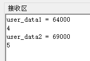

其地址分别在FLASH2和FLASH3的首位，同时其数值也是正确的。

4、此时我们检查编译信息进行对比：

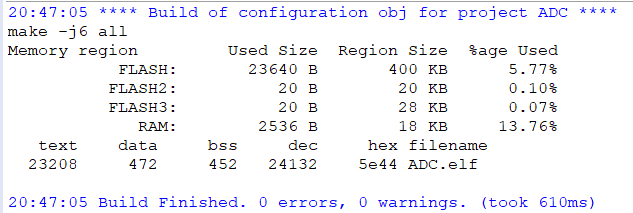

 分配空间与使用均为合理，操作成功。

## 注：报错检查：

1、请检查一下分配地址时是否有断开，如448K的FLASH，只分配了200K；

2、是否有重叠，如分配RAM时，首地址从0开始，抢占了FLASH的区域。

## 附：原始工程参考

CH573_MRS_AssignFLASH

- [SweeetTeea/sys: TEST (github.com)](https://github.com/SweeetTeea/sys)

## 附：常量定义在指定FLASH区域：

### 方法1：

指定字符串放在FLASH中

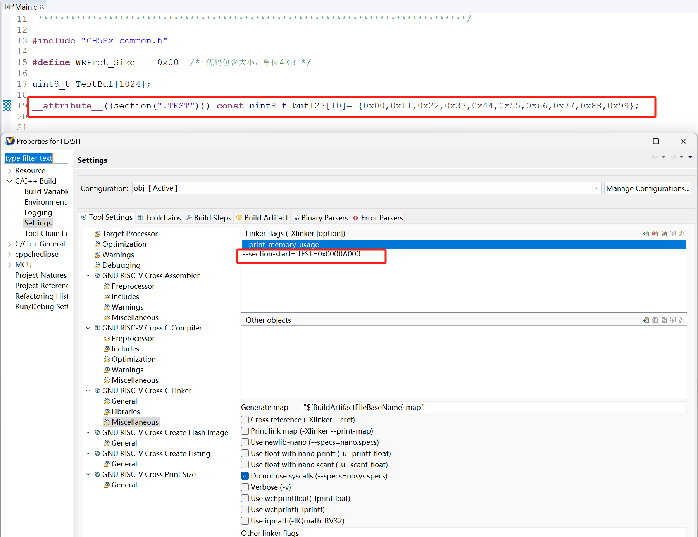

--section-start=.TEST=0x0000A000

__attribute__((section(".TEST"))) const uint8_t buf123[10]= {0x00,0x11,0x22,0x33,0x44,0x55,0x66,0x77,0x88,0x99};

注意配置后再memcpy一下，防止被优化。

### 方法2：

在ld文件的SECTIONS段添加如下：

```c
    .flash_test_address :
	{
		. = ALIGN(4);              /*4字节对齐*/
		. = ORIGIN(FLASH)+0x14000;  /*ORIGIN(FLASH)为 MEMORY定义的FLASH的起始地址，指定到从FLASH起始的0x14000长度的位置*/
		KEEP(*(SORT_NONE(.test_address_1)))  /*链接时*KEEP()可以使得被标记段的内容不被清除*/
		. = ALIGN(4);
	} >FLASH AT>FLASH 
```

定义：

```c
__attribute__((section(".test_address_1"))) const uint8_t buf_1[] = {0x0a,0x0b,0x0c,0x0d,0x0e,0x0f};/*地址为0x00014000*/
```

查看二进制文件：

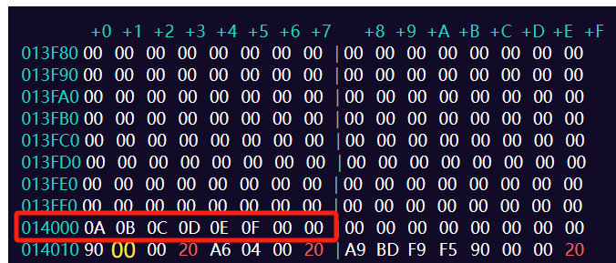

# v208工程显示编译后占用的flash与ram大小

以RISC-V MCU IDE MounRiver Studio(MRS)为例，首先我们选中目标工程，点击工具栏工程属性按钮，打开工程属性配置页：

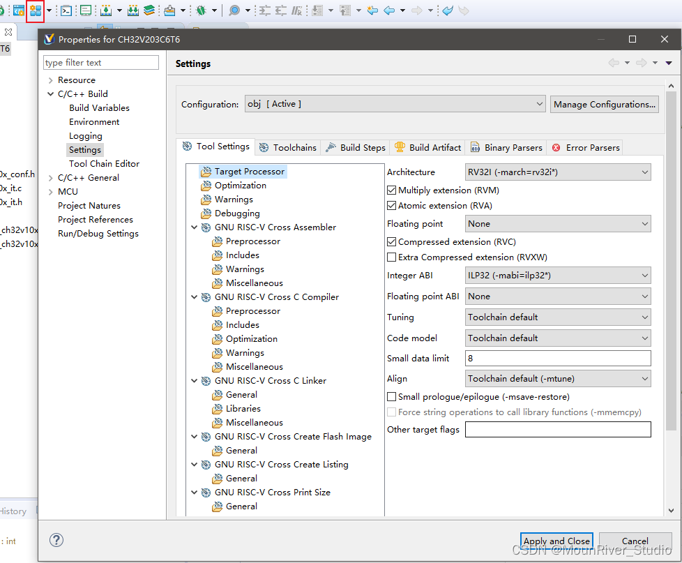

在C/C++ Build->Settings->Tool Settings选项列表中单击GNU RISC-V Cross C Linker->Miscellaneous，然后在右侧Linker flags窗口添加命令行：“–print-memory-usage”,最后点击Apply and Close保存修改。此时再次编译工程,则会显示FLASH及RAM的使用占比情况.


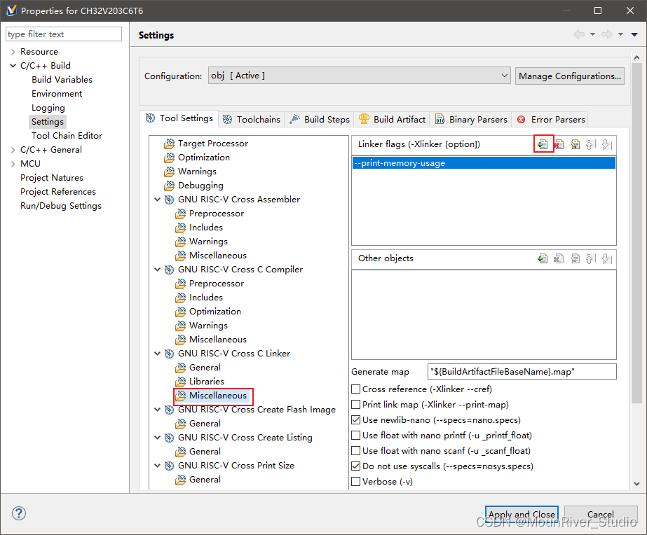

# V208工程跑仿真会进hardfault，增大仿真支持的代码大小

如图添加两行代码

-c init

-c "wch_riscv unfreeze"

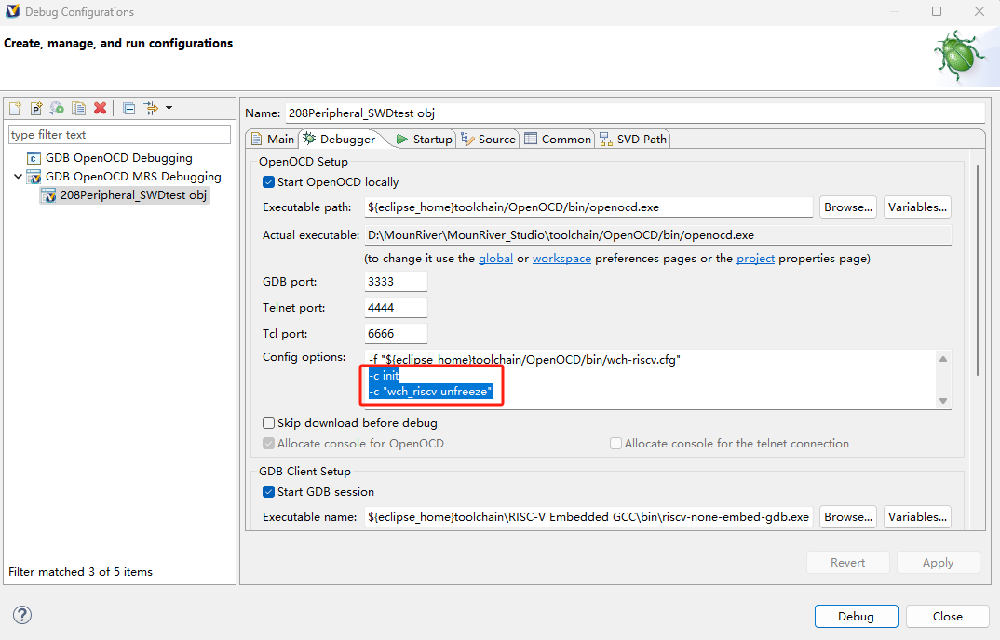

 

# MRS中查看每个函数编译后占用的codeflash大小

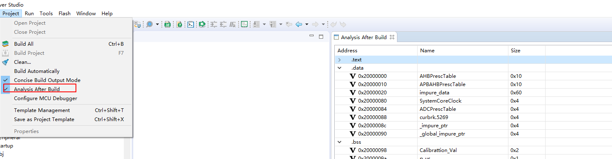

# 修改MRS界面的UI图标大小

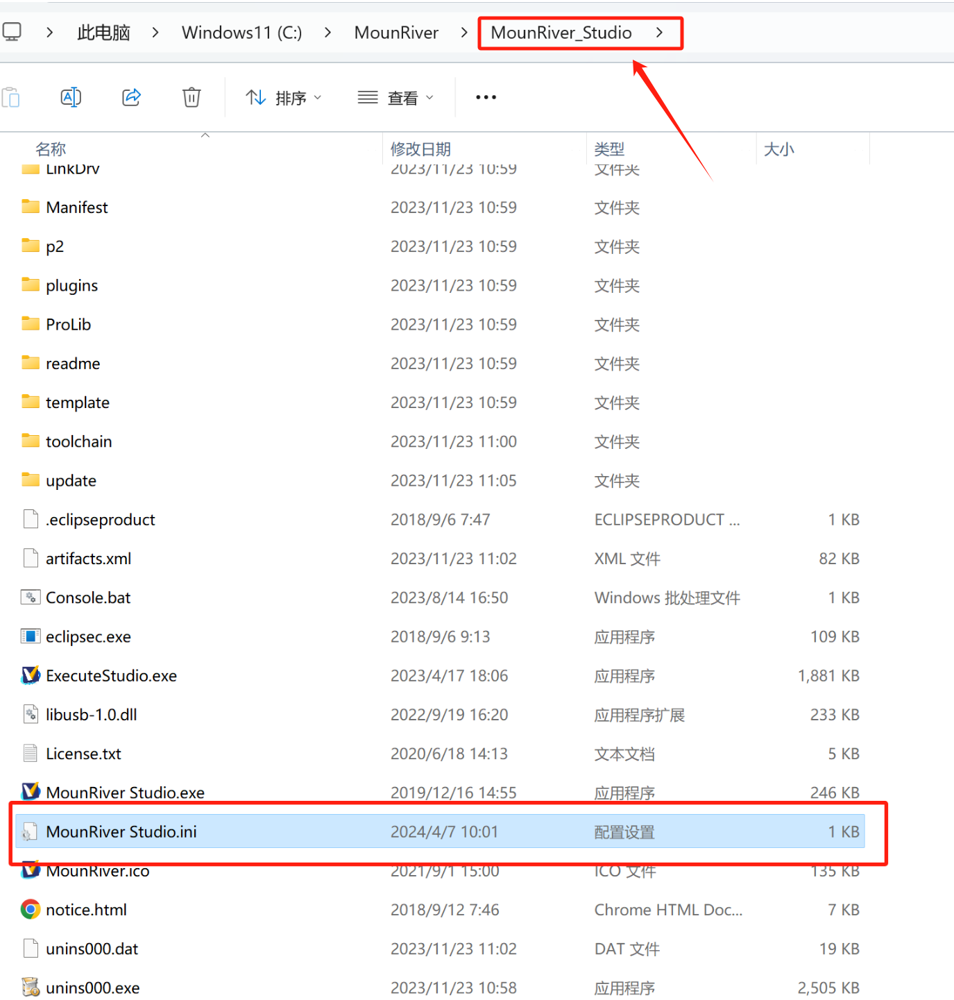

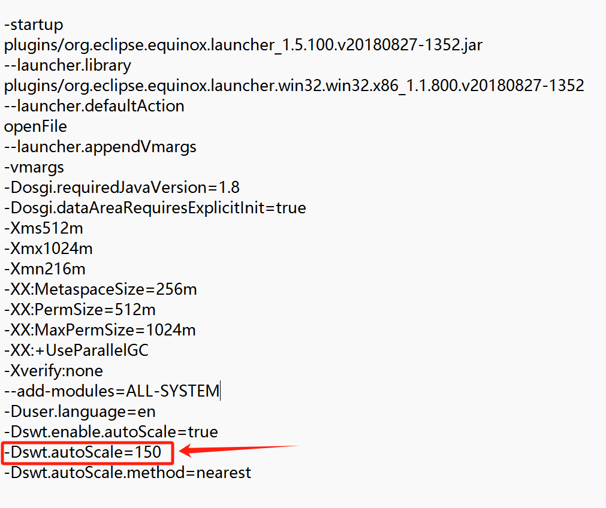

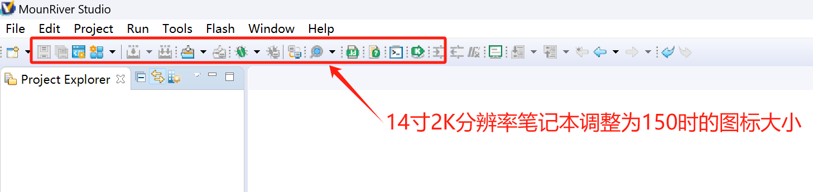

# 取消对未使用的“highcode”修饰函数的编译

通常配置下，当一个.c源文件中，有某个函数被工程使用到，那么这个源文件中所有被“highcode”修饰过的函数，都会被加入编译，占用ram/flash资源。

如：BLE工程中，启用了HAL_SLEEP宏定义后，StdPeriphDriver文件夹下的xxx_pwr.c源文件中，void LowPower_Sleep(uint16_t rm)函数会被用于sleep休眠；但还有部分函数被highcode修饰，比如说void LowPower_Halt(void)函数，工程中实际没有被调用，其也会占用ram/flash资源。

增加下方勾选，可规避该问题。

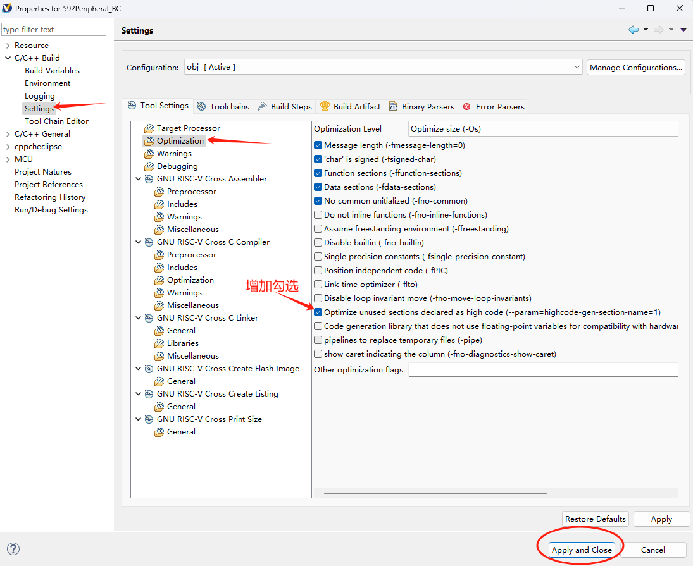